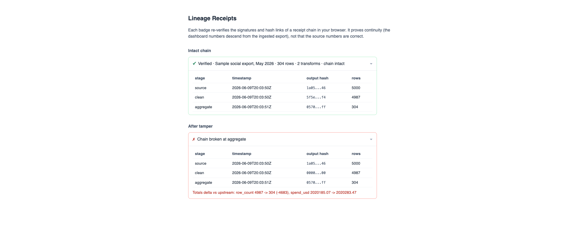

<sub>tamper-signal</sub>

# The light is green, the data is clean.

Your social team exports a month of TikTok performance data. Someone vibe-codes a dashboard on top of it with an AI assistant in an afternoon. It looks great. Then a transform silently drops 22 rows, or the model hallucinates an aggregation, and the numbers in front of your boss are wrong. Nothing in that workflow catches it. This is the missing verification layer: every stage of the pipeline signs a receipt for what went in and what came out, and one command (or a badge on the dashboard itself) tells you whether the chain is intact, or exactly where it broke and by how much.

**Live demo:** [tampersignal.com](https://tampersignal.com/) re-verifies a real committed receipt chain in your browser: swap in a tampered chain or an untrusted key and watch the light catch it.

**Pointing a coding agent at this repo?** `AGENTS.md` is the full integration runbook: install, keygen, ingest, wrap transforms, mount the signal, verify. Tell your agent "add tamper signal" and it will find it.

## The problem

Vibe-coded pipelines fail silently. AI-generated transform scripts work most of the time, and when they don't, they don't crash. They drop rows. They double-count. They coerce a column wrong and quietly shift every total. The dashboard still renders. The chart still looks plausible. Nobody re-checks 48,000 rows by hand.

Traditional answers (warehouse lineage, dbt, data-quality suites) assume infrastructure a small team running xlsx-to-dashboard doesn't have. This is the lightweight version: signed receipts as files on disk, no database, no server, no catalog.

## The traffic light

The badge and the verifier reduce the whole chain to one state:

- 🟢 **Green.** Every link in the receipt chain verifies. Every signature is valid. The data made it from the original export to the dashboard unchanged.
- 🟡 **Yellow.** Verifiable, but with caveats: gaps in receipt coverage, an unrecognized signing key, or control-total drift that needs a human look.
- 🔴 **Red.** Chain broken. A hash doesn't match at a specific link. You get the exact stage and the control-totals delta (e.g. `row_count 48212 -> 48190 (-22)`).


*The inline status light: a small dark instrument in your dashboard's header. When the chain breaks, it reaches into the page and flags the exact metric that no longer descends from the source.*

Honest status: all three verdicts are implemented in `receipts verify` and the browser badge. Yellow today covers two detectable caveats (a coverage gap in the receipt numbering, and signatures that only verify under the chain's embedded key rather than the key you trust) plus opt-in control-total drift via `--warn-drift`. The Data tab and console animations in this README are design previews of later interface tiers, built from the working mockups in `designs/`. The badge also renders a separate amber state ("could not load" or "verification unsupported in this browser"); that is a capability fallback that says nothing about the chain, not the yellow verdict.

## 60-second quickstart

Python 3.11+. Open source (MIT), `pip`-installable.

```bash
git clone <this repo> && cd tamper-evident-verification
pip install -e .
receipts demo
```

`receipts demo` runs the whole story end to end: generates a deliberately messy sample export, ingests it, runs two AI-written-style transforms, verifies the chain (PASS), then tampers with one spend value and verifies again (FAIL, pinpointing the broken link and the totals delta). It finishes by serving the badge at `http://localhost:8000/badge/badge.html` so you can see green, yellow, and red side by side.

## CLI

```bash
receipts keygen --out keys/
receipts ingest sample_export.xlsx --origin "TikTok export, May 2026" --key keys/signing.key --out receipts/
receipts verify receipts/chain.json --pub keys/signing.pub --data dashboard.xlsx
```

`ingest` and `verify --data` accept .xlsx, .csv, .tsv, .json (array of objects), and .ndjson; the semantic hash is identical across formats, so an xlsx ingest verifies against a CSV copy of the same data. `verify` exits with the traffic light: 0 green, 1 red, 2 yellow (verifies, with caveats). Add `--warn-drift` to also flag any control-totals movement across links as a caveat; it is off by default because filters and aggregations legitimately move totals.

Transforms record their own receipts by wrapping any list-of-dicts to list-of-dicts function:

```python
from tamper_signal import receipt_step

@receipt_step(chain_dir="receipts/", key_path="keys/signing.key")
def transform_clean(records):
    return [r for r in records if r.get("campaign_name")]
```

The wrapper verifies the chain tail first, refuses to run if the input hash doesn't match it, runs the function, then signs and appends a receipt. Transforms can also take and return pandas DataFrames; frames are hashed as records and pass through untouched.

## JavaScript pipelines

The same receipts, native to Node (18.17+): `npm install tamper-signal` provides a `tamper-signal` CLI (keygen, ingest, verify, with the same exit codes) and a programmatic API. Chains are interchangeable across the two stacks; the canonicalization is byte-identical, proven by golden vectors generated from the Python side.

```js
import { receiptStep, loadCsv } from "tamper-signal";

const clean = receiptStep(
  (records) => records.filter((r) => r.campaign_name !== null),
  { chainDir: "receipts/", keyPath: "keys/signing.key" }
);
const output = await clean(loadCsv("export.csv"));
```

JavaScript reads .csv, .tsv, .json, and .ndjson; spreadsheets go through the Python CLI. The browser surfaces ship in the same package: `tamper-signal/light`, `tamper-signal/badge`, `tamper-signal/element`, `tamper-signal/react`.

## How the chain works

```
TikTok/Sprinklr export.xlsx
        |
        v
  [ingest] ──────────> 000_source.json        evidence hash + semantic hash + totals, signed
        |
        v
  [transform_clean] ─> 001_transform_clean.json    input hash == previous output hash
        |
        v
  [transform_agg]  ──> 002_transform_aggregate.json
        |
        v
  dashboard data  <─── receipts verify: walk every link, check every signature
```

Each receipt contains the SHA-256 of its input, the SHA-256 of the transform's source code, the SHA-256 of its output, and human-legible control totals (row counts, numeric sums, date ranges, null counts). Receipts link because each stage's input hash must equal the prior stage's output hash. Everything is signed with Ed25519; `chain.json` is just an ordered list of receipt files plus the public key.

Two hashes exist per artifact. The **evidence hash** anchors the raw file bytes at ingest. The **semantic hash** covers the canonicalized data content, stable across format round-trips (xlsx re-save, xlsx to CSV, xlsx to JSON) so long as the values are unchanged. Row order is not part of integrity: rows are sorted before hashing.

When verification fails, you don't get a shrug. You get the link:

```
✗ CHAIN BROKEN at link 1 -> 2 (transform_aggregate)
  expected input hash a3f1...9c  (output of transform_clean)
  found    input hash 77b2...d4
  Control totals delta vs upstream: row_count 48212 -> 48190 (-22), spend_(usd) -98.40
```

Hashes say "broken." Totals say "how broken."

## The badge

`badge/badge.js` exports `renderReceiptBadge(containerEl, chainUrl, pubKeyHex)`. Drop it into any web frontend, point it at your `receipts/chain.json`, and it re-verifies the whole chain client-side with Web Crypto Ed25519: every signature, every hash link. No build step, no framework, no server-side trust. The badge re-checks hash links only; it does not re-canonicalize xlsx in the browser.



Green collapsed state reads like: `✓ Verified · TikTok export, May 2026 · 48,212 rows · 2 transforms · chain intact`. Expanding shows one row per receipt.

## The signal: an inline status light

`badge/light.js` is the v1 dashboard UI: a small dark pill that mounts in your header, runs the same in-browser verification as the badge, and shows the verdict as the light. It deliberately refuses to adopt your dashboard's theme; like a tamper sticker, its value comes from being recognizable anywhere. One call:

```html
<script type="module">
  import { mountTamperSignal } from "/badge/light.js";
  mountTamperSignal(document.querySelector("header"), "/receipts/chain.json");
</script>
```

React, with a bundler: `import { TamperSignal } from "tamper-signal/react"` and `<TamperSignal chain="/receipts/chain.json" />`. Everything else (Vue, Svelte, plain HTML): import `tamper-signal/element` and write `<tamper-signal chain="/receipts/chain.json"></tamper-signal>`.

The pill expands to a popover: the per-stage table when green, the caveat list when yellow, the broken link with its totals delta when red. In the red state the light also reaches into the page: give any metric element a `data-receipt-column="spend_usd"` attribute, and if that column moved at the broken link the element gets outlined and tagged `tamper signal: unverified value`. Mark up your metrics once and the light flags the exact number that no longer descends from the source.

Options on the fourth argument: `watch` (re-verify every N ms and pulse on transitions), `warnDrift`, `receiptsHref`, and `theme: "light"` so the pill stays the one foreign object on a dark host. `receipts demo` serves a live three-state example at `http://localhost:8000/badge/light.html`.

## Dashboards should show their work

We think any dashboard built on verified data should let you see the data. Not a tooltip, not an export-on-request: a Data tab, right next to the charts, showing the raw verified table the pretty numbers came from. If the chain is intact and the light is green, there is no reason to hide the rows, and if you find yourself wanting to hide them, that's worth sitting with. A chart asks you to believe; a table lets you check. Green light, open table: that's the whole standard.


*Design preview: install the verification layer and your dashboard grows a Data tab. When the chain breaks, the break is localized to the column and total that no longer verify, right in the table.*

## What this proves, and what it doesn't

This proves **continuity, not correctness**. It can't tell you the data is right, but it can prove nobody changed it. The chain shows the dashboard numbers descend from the ingested export through a known sequence of code, and it locates the exact stage where a number changed unexpectedly. If the source export is itself wrong, the chain faithfully verifies wrong numbers. It is not a data-quality tool.

Also worth knowing: the signing key lives on your machine, and today that local Ed25519 keypair is the whole root of trust. Anyone holding the key can sign a fresh, internally consistent chain. External anchoring (below) is what closes that gap.

## Roadmap

- **Richer yellow taxonomy.** Yellow currently detects coverage gaps, unrecognized signing keys, and opt-in totals drift. Distinct severities and smarter drift heuristics are open questions (see `designs/01-NOTES.md`).
- **External anchoring.** Sigstore transparency logs or RFC 3161 timestamps, so a chain can't be silently re-signed after the fact. The attachment points are already marked `FUTURE:` in `tamper_signal/keys.py` and `tamper_signal/receipts.py`.
- **Verification console.** A devtools-for-data window: the receipt chain as an inspectable pipeline, an event log of verify runs, and the break pinned at the severed link.


*Design preview of the verification console: calm when green, surgical when red.*

## Relation to OpenLineage, dbt, and Great Expectations

Those tools model lineage and quality at the warehouse and orchestration layer. This is narrower and lighter: a signed, file-based receipt chain you can drop in front of an ad-hoc, vibe-coded xlsx-to-dashboard pipeline without a database, a server, or a metadata catalog. A complement for the gap before those tools are in place, not a replacement.

## Contributing

Open source under the MIT license (see `LICENSE`), designed to be added to any vibe-coded data project. The Python package is in `tamper_signal/`, tests in `tests/` (run `pytest`), examples in `examples/`, the badge in `badge/`. Issues and PRs welcome. The original Luhn hash demo lives unchanged in `legacy/` and is off the main path.
