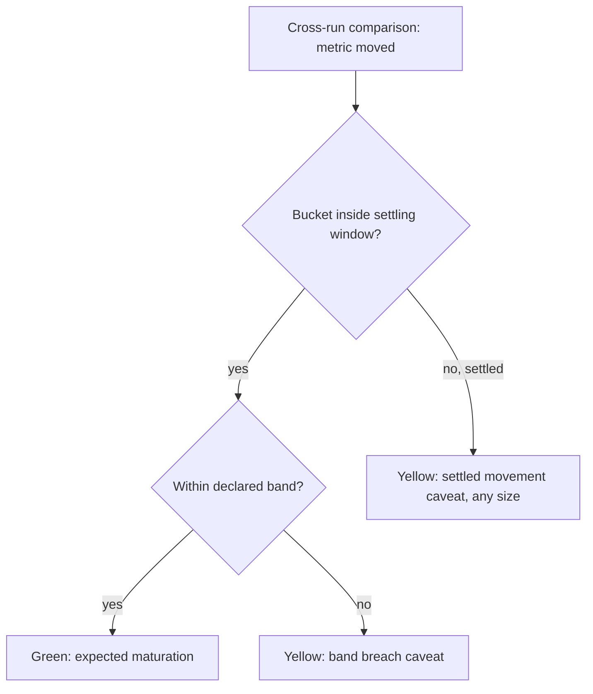

# Period-over-period continuity: memory, drift bands, and real anomaly callouts

## Summary

Give the receipt chain a memory and a sense of normal. `receipts diff` and `receipts log` compare archived runs and name exactly what moved; producers can opt in to a tolerance declaration signed into the chain at ingest (default band 5% day-over-day, settling window 72h) with a two-zone judgment: maturing data may drift inside the band, settled data is frozen and any movement flags. Out of the box, verification stays exact and one-for-one.

---

## Problem Frame

Real-world reporting exports drift on purpose. Paid media, social, and GA data recalculates for 24 to 48 hours as late conversions land and attribution backfills, settles by day 2 or 3, and then stops moving. Day-over-day movement under 5% on any metric is not reportable; it is expected noise.

Tamper Signal's verification today is a sameness check. For a pipeline that refreshes on a schedule, "different from yesterday" is always true and therefore carries no signal. The existing `--warn-drift` flag ships off by default for exactly this reason: filters, aggregations, and maturing data legitimately move totals, so a binary drift warning would fire daily. A trust tool that cries wolf on normal drift gets muted, and a muted trust tool is worthless.

There is also no run-over-run memory. Receipts accumulate on disk with control totals in every run, but no diff or compare primitive exists in either stack. When this week's numbers look different, the user cannot ask the tool whether the data moved or the pipeline changed.

---

## Key Decisions

- **Strict by default; tolerance is a signed opt-in.** A new user's first trust test is editing one cell and watching for the light to catch it. If the answer is "that is within tolerance," the tool reads as broken in its first five minutes. Absent a declaration, verification behavior is exactly what ships today. A producer who declares a band has, by definition, understood what they declared.
- **Tolerance declarations live in the chain, signed at ingest.** Not a verifier-side policy file. Loosening a band after the fact breaks the signature, which is the credibility argument for having bands at all.
- **Two-zone judgment, not a flat band.** Drift is a settling window, not constant wobble. Within the window (default 72h), movement inside the band is green. After settling, the data is frozen: any movement flags, at any size. This is both quieter day-to-day and more protective than a flat band.
- **Cross-run anomalies are yellow, never red.** Red stays reserved for a broken chain or a data mismatch within a run. A band breach or settled-period movement is "a human should look," with a caveat that names the metric, period, and delta.
- **Run history accrues automatically.** Each verified run archives a compact totals snapshot so diff and log work without the user remembering to save anything.
- **One global band in v1.** The default band applies to every tracked metric. Per-metric overrides are deferred.
- **Inference is a helper, never a judge.** Learning "normal" from history and silently flagging outliers makes verdicts unexplainable and history-dependent. A future `suggest-bands` helper may propose a declaration from history; a human signs it.

---

## Requirements

**Memory: diff, log, and run history**

- R1. `receipts diff <chainA> <chainB>` compares two runs and reports, per stage: code-hash changes and the control-totals delta (row counts, numeric sums, null counts, date ranges). It works on any two chains, with or without tolerance declarations.
- R2. Every verified run archives a compact totals snapshot automatically; history accrues by default with no user action.
- R3. `receipts log` renders archived history as a per-metric trend across runs (day, week, month, quarter granularity).
- R4. Diff and log are read-only; they never modify chains, receipts, or archived snapshots.

**Tolerance declarations**

- R5. A producer may declare tolerance at ingest: a band (default 5% day-over-day) and a settling window (default 72h). The declaration is recorded in the source manifest and covered by its signature.
- R6. With no declaration present, verification is exact and unchanged from current behavior.
- R7. Verification honors only bands sourced from the signed chain; changing a declaration requires re-ingest.
- R8. The declared band applies to all tracked control-totals metrics (row counts, numeric sums, null counts) uniformly.

**Two-zone judgment**

- R9. With a declaration present, cross-run comparison judges each period bucket: buckets inside the settling window may drift within the band and stay green; movement beyond the band trips yellow.
- R10. Buckets older than the settling window are settled: any movement, at any size, trips yellow with a caveat naming the period and the delta.
- R11. Two-zone judgment requires per-period bucketed control totals keyed off the data's date column, recorded in receipts. Datasets without a date column fall back to the flat band over whole-table totals, with no settled-zone judgment.
- R12. Cross-run anomalies never produce red. Red remains reserved for a broken chain or a within-run data mismatch.
- R13. Band-breach and settled-movement caveats are distinct caveat types, each naming the metric, the period, and the delta.

**Cross-stack and spec**

- R14. Python and JS reach parity: same commands and semantics, bucketed totals join the golden vectors, and the spec version bumps with fixtures regenerated in the same commit.
- R15. New caveat copy follows `docs/MESSAGING.md`: fixed verdict lines, no em dashes, and no claims of accuracy or correctness anywhere in diff, log, or caveat output.

---

## Key Flows

- F1. The skeptic's first five minutes
  - **Trigger:** New user installs, ingests a spreadsheet, edits one cell, runs verify.
  - **Steps:** No declaration exists; verification compares exactly; the edit is caught.
  - **Outcome:** Red, naming the mismatch. First impression preserved.
- F2. Weekly refresh under a declaration
  - **Trigger:** Scheduled re-ingest and rebuild of a paid-media export.
  - **Steps:** Run verifies; a totals snapshot is archived; cross-run comparison finds recent buckets drifted 3 to 4%.
  - **Outcome:** Green. `receipts log` shows the settling curve flattening over 2 to 3 days.
- F3. Settled-period change
  - **Trigger:** A value in a three-week-old period differs from the archived history.
  - **Steps:** Cross-run comparison finds movement in a settled bucket.
  - **Outcome:** Yellow with a settled-movement caveat naming the period, metric, and delta. `receipts diff` against the prior run shows whether code also changed.

---

## Acceptance Examples

- AE1. **Covers R5, R9.** Given a declaration of 5%/72h, when yesterday's impressions total moves +4.8% on refresh, then the light is green and no caveat is emitted.
- AE2. **Covers R9, R13.** Given the same declaration, when yesterday's impressions total moves +9%, then the light is yellow with a band-breach caveat naming impressions, the period, and +9%.
- AE3. **Covers R10, R13.** Given the same declaration, when a 21-day-old bucket's row count changes by 1, then the light is yellow with a settled-movement caveat naming the period and the delta.
- AE4. **Covers R6.** Given no declaration, when any total moves between the receipt and the data, then behavior matches today's exact verification.
- AE5. **Covers R11.** Given a declaration on a dataset with no date column, when totals move 3% on refresh, then the flat band judges whole-table totals and no settled-zone caveat can occur.
- AE6. **Covers R12.** Given any band breach or settled movement, when verification completes, then the exit code is 2 (yellow), never 1.

---

## Scope Boundaries

**Deferred for later**

- `suggest-bands` helper that proposes a declaration from accumulated run history.
- Browser trend/history view; band-breach caveats surface through the existing yellow-caveat rendering in v1.
- Per-metric band overrides.
- Alerting, webhooks, and scheduled re-verification.
- Fleet or multi-pipeline roll-ups.

**Outside this product's identity**

- Statistical or learned anomaly detection acting as a judge. Verdicts must be reproducible and explainable from signed declarations alone.
- Any claim of accuracy or correctness. Bands are the producer's declared expectation of continuity, never a statement that the data is right.

---

## Dependencies / Assumptions

- The 5% band and 72h settling window defaults come from observed reporting behavior (paid media and GA settle within 24 to 48 hours; day-over-day movement under 5% is not reportable). They are product copy, revisitable without spec changes.
- Per-period bucketed totals are a receipt-format addition: spec version bumps from 1.1, golden vectors and fixtures regenerate in the same commit, and both stacks ship together (per the canonicalization learning in `docs/solutions/logic-errors/numeric-text-canonicalization-cross-format-hash-mismatch.md`).
- A `totals_delta` primitive already exists in `tamper_signal/totals.py` (used for broken-link reporting) and is the natural seed for diff.
- The existing within-chain `--warn-drift` flag is unrelated to cross-run judgment and ships unchanged; whether it later folds into the typed-caveat system is planning's call.
- A run-identity and retention convention does not exist yet and must be defined in planning (what constitutes a run, where snapshots live, growth bounds).

---

## Outstanding Questions

**Deferred to planning**

- Run identity, archive layout, and retention bounds for snapshots.
- Snapshot format and whether it is itself signed.
- How `receipts log` renders trends in a terminal (table, sparkline, or both).
- How declarations are expressed at the CLI (flag shape, config in `receipts init`).
- Interaction with `rebuildChain` and the JS idempotent-rebuild path.

---

## Sources

- `docs/ideation/2026-06-11-open-ideation.html`, idea "Period-over-period continuity" (origin of this brainstorm).
- `tamper_signal/receipts.py:501` (`warn_drift` implementation), `tamper_signal/totals.py` (`control_totals`, `totals_delta`).
- `tamper_signal/__init__.py` (`SPEC_VERSION = "1.1"`).
- `CONCEPTS.md` (canonical vocabulary: Receipt, Chain, Control totals, The light, Continuity, Spec version, Golden vectors).
- `docs/MESSAGING.md` (verdict copy rules).
