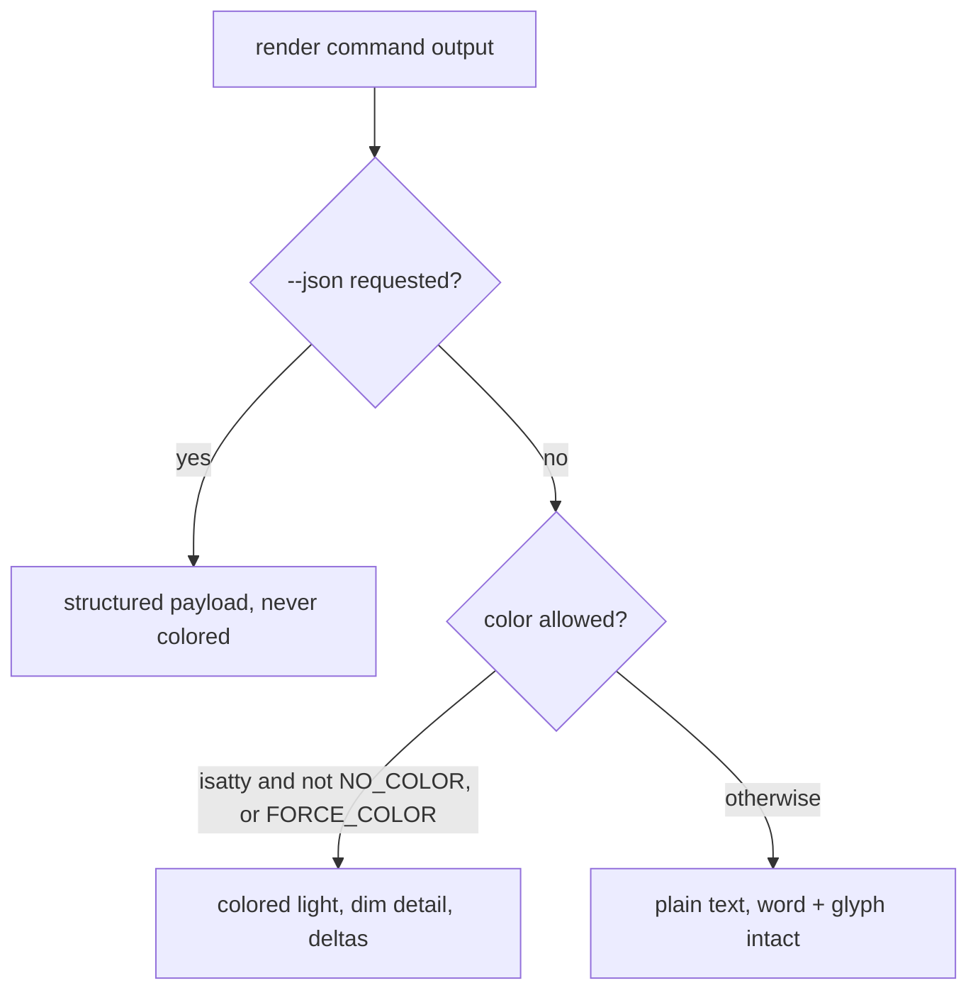

# CLI 1.7.1: finish the `--json` surface and make the terminal delightful

## Summary

1.7.1 completes the CLI's two faces. The machine face gains `--json` on `ingest`,
`export`, and `doctor` (the three commands that still lack it), plus declared
`band` and `settle_hours` on `log --json`. The human face gains a colored `●`
traffic light that agrees with the exit code, dimmed hashes, aligned columns,
colored `diff`/totals deltas, and a tasteful first-run banner. Both faces ship in
the Python (`receipts`) and node (`tamper-signal`) CLIs together, with identical
palette, gating, and JSON shapes.

## Problem Frame

The CLI is the first thing every human user touches and the surface every agent
scripts against, and neither face is finished. On the machine side, `verify`,
`diff`, `log`, and `anchor` emit `--json`, but `ingest`, `export`, and `doctor` do
not, so an agent driving a pipeline has to scrape human text for exactly the
commands that report what just happened. On the human side there is no color at
all: the verdict that the whole product is built around is rendered as plain words
and a `✓`/`✗` glyph, with hashes and totals undifferentiated in one flat tone.

The product already owns the traffic-light metaphor; the terminal just doesn't show
it. The constraint is that this is a trust tool, so polish must amplify the verdict,
not decorate over it, and color must never corrupt the machine output the other half
of this release is trying to perfect.

## Key Decisions

- **Expressive, not maximal.** Color carries meaning (the `●` light, deltas, dimmed
  detail) and adds a first-run banner on `init`/`demo`. It stops there: no spinners,
  emoji, animation, or celebratory copy. Red stays grave; yellow asks for eyes.
- **Both stacks ship together.** The Python and node CLIs get the same `--json`
  surface and the same color treatment in 1.7.1, rather than a faster Python-first
  split, because the product's identity is two interchangeable stacks that should
  look and script identically.
- **A hand-rolled ANSI helper, not a library.** Color is a small self-contained
  helper in each stack, adding no runtime dependency. This preserves the deliberately
  minimal footprint (Python: `openpyxl` + `cryptography`; node: zero-dependency).
- **Color is redundant, never load-bearing.** The verdict word and glyph remain when
  color is absent, so colorblind users, `NO_COLOR`, and piped output lose nothing.
- **Clean stdout is non-negotiable.** ANSI is gated to an interactive terminal and is
  never emitted under `--json` or to a pipe/redirect. This extends the existing
  discipline where notices already go to stderr to keep `--json` stdout untouched.
- **Control surface stays small.** `--no-color` plus `NO_COLOR` / `FORCE_COLOR` plus
  automatic TTY detection. A `--color=always|auto|never` tri-state is out of scope.

The gating logic for any command's stdout:

## Requirements

**Machine face: the `--json` surface**

R1. `ingest`, `export`, and `doctor` gain a `--json` flag in both CLIs, each printing
a single structured object to stdout. (`verify`, `diff`, `log`, `anchor` already have
it and are unchanged.)

R2. Each new payload mirrors the command's human output as structured fields: `ingest`
carries the source filename, evidence and semantic hashes, row/column counts, and the
tolerance declaration when present; `export` carries the output path, row/column
counts, data hash, and whether a bundle was written; `doctor` carries the per-check
name / pass / fix list, the warnings list, and an overall pass flag.

R3. `log --json` additionally surfaces the declared `band` and `settle_hours` from the
source manifest when a tolerance declaration is present.

R4. New payloads follow the established convention: a pretty-printed object on stdout,
failures rendered as a structured error object rather than a bare line, and all human
notices routed to stderr so stdout stays a clean payload.

R5. For each command, the Python and node `--json` payloads are shape-identical (same
keys), matching the existing verify-parity discipline.

**Human face: color and presentation**

R6. The verdict renders as a colored `●` light — green, amber, or red — that always
agrees with the exit code (0 / 2 / 1) and the verdict word.

R7. Hashes and secondary detail are dimmed, and label columns align, so everyday output
scans at a glance.

R8. `diff` and totals deltas color the direction of movement (decreases and increases
visually distinct) to draw the eye to what changed.

R9. `init` and `demo` show a restrained first-run banner. No command uses spinners,
emoji, animation, or celebratory copy; a red verdict carries no ornament.

R10. Color is applied to the verdict-bearing commands and as light accents elsewhere,
and is always redundant with text — never the sole carrier of meaning.

**Gating and control**

R11. ANSI escapes are emitted only when stdout is an interactive terminal. Piped,
redirected, and non-TTY output is plain text, the banner included.

R12. `--json` output is never colored, on any stream, regardless of TTY state.

R13. `NO_COLOR` forces color off, `FORCE_COLOR` forces it on past the TTY check, and a
`--no-color` flag is available. No `--color=when` tri-state.

R14. Color is a small self-contained ANSI helper in each stack with no new runtime
dependency; the two helpers share one palette and one gating rule.

**Cross-stack and testing**

R15. Both the `--json` surface and the color treatment ship in the Python and node CLIs
together in 1.7.1, with identical palette, gating, and JSON shapes.

R16. A regression test in each stack asserts that no ANSI escape sequence appears in
`--json` output or in non-TTY/piped output. This is the release's acceptance gate.

R17. The new `--json` payload shapes are pinned by tests in both stacks, in the spirit
of the existing cross-stack verify expectations.

## Acceptance Examples

AE1. **Covers R6, R11.** Given a green chain, when `receipts verify chain.json` runs in
a terminal, stdout shows a green `●` with the word GREEN; the same command piped shows
the word and glyph with no ANSI.

AE2. **Covers R12, R16.** When any command runs with `--json`, or with stdout piped to
another process, the captured bytes contain no ANSI escape sequence.

AE3. **Covers R13.** When `NO_COLOR` is set in a terminal, output is plain text with the
word and glyph intact; when `FORCE_COLOR` is set and output is piped, color is emitted —
except under `--json`, which stays clean.

AE4. **Covers R9.** When a red verdict renders, it shows a red `●`, the word RED, and the
broken link, with no emoji or celebratory text.

## Scope Boundaries

**Deferred for later**

- A full TUI or interactive mode, and animated progress / spinners.
- A `--color=always|auto|never` tri-state and per-theme palettes.

**Outside this product's identity**

- Emoji or celebratory verdict copy, and anything that softens the gravity of a red.

## Success Criteria

- The no-ANSI-leak test passes in both stacks — the hard gate for the release.
- Piping or `--json`-ing any command yields byte-clean machine output.
- Python and node emit identical JSON keys per command and tell one identical
  palette-and-gating story.
- Everyday `verify` / `diff` / `log` output reads as scannable and warm in a terminal
  without reading as a toy.

## Dependencies / Assumptions

- No new runtime dependency in either stack; the ANSI helper is hand-rolled.
- Control surface is assumed to be `--no-color` + `NO_COLOR` / `FORCE_COLOR` + TTY
  detection, with no tri-state (affirmed in dialogue).
- Base is v1.7.0. The `--json` flag on `verify` / `diff` / `log` / `anchor` and the
  stderr-notice discipline already exist and set the conventions this work extends.

## Sources / Research

- Ideation candidates #6 and #12: `docs/ideation/2026-06-23-release-1.7.1.html`.
- Python CLI: `tamper_signal/cli.py` — `cmd_ingest` (~216), `cmd_export` (~756),
  `cmd_doctor` (~583), `verify --json` payload (~461–506); the stderr-notice rule that
  keeps `--json` clean lives at `tamper_signal/cli.py:300` and `:428`.
- Node CLI: `node/cli.js` — `verify --json` (~403, "same payload shape as the Python
  CLI"), `diff` (~635), `log` (~973); `ingest` / `export` / `doctor` lack `--json`.
- Dependency footprint: `pyproject.toml` base deps `openpyxl` + `cryptography`
  (`sigstore` optional); the node package declares no runtime dependencies.
