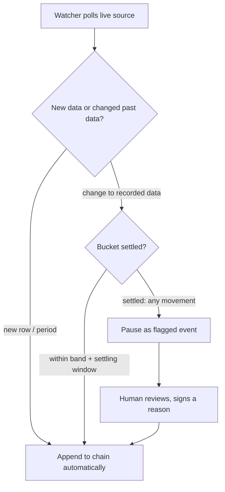

# Tamper Signal v2.0: end-to-end data provenance, run on your app

## Summary

v2.0 turns Tamper Signal from a verify-and-badge library into an end-to-end data provenance system that runs inside the user's own app. The inspector console becomes the default chain-of-custody view — every import (with its origin), every change (with a signed reason), and every reupload logged as one provable timeline — alongside an enforced verified data table. An embedded watcher brings live API/JSON/RSS sources onto the same signed chain, appending new data and routing retroactive changes through the existing tolerance judgment. Shipped as one coordinated 2.0.

## Problem Frame

v1.x proves continuity well: a green light says the data on screen descends unchanged from the signed source, and a broken chain names the exact link and delta. But the proof is point-in-time and the surfaces are scattered. The flagship surface is a small status light; the console exists but is an opt-in debugging widget that shows the current chain and a per-verify event log, not the data's history. There is no record of *why* a value changed, no first-class view of a dataset's life across reuploads, and no way to keep a continuously-updating source under custody — every refresh is a manual re-ingest.

The result: a user can prove the current numbers are intact, but cannot hand someone the full story of how the data got here, who changed what and why, and whether a live feed quietly revised last month's figures. For "vibe-coded" pipelines that refresh on a cadence and get hand-edited under deadline, that history *is* the trust question. v2.0 makes the custody story a first-class, provable artifact.

## Key Decisions

- **Embedded watcher, not a hosted service.** Live sources are monitored by a watcher the user runs inside their own app, default-shaped as a stateless scheduled tick (poll once, append or flag, exit) with an optional long-running daemon for continuous polling. Nothing — data or proof — leaves the user's environment. The scheduled-tick default keeps the file-on-disk, no-required-process model (a green light never depends on the watcher running) while evolving the identity from *"no infrastructure"* to *"no third-party infrastructure; your data and its proof never leave your app."*
- **Comments are signed into the chain, with self-declared authorship.** A change's reason and an author are captured in the signed structure, so the provenance narrative is as tamper-evident as the data. The author is signed attribution, not verified identity ("signed by ⟨key⟩, attributed to ⟨author⟩"). The cost is immutability: a comment is corrected by appending a new signed annotation, never by editing.
- **Enforced table is default-on, not coercive.** The verified table is always present and always honest by default — it shows its red/stale state but never blocks other UI — with an opt-in strict mode that gates other views on a broken chain for teams that want the harder guarantee.
- **Live retroactive changes reuse band/settle.** Rather than a new policy, a past-date change is judged by the declared tolerance: within band and inside the settling window it folds in automatically; once a bucket is settled, any movement pauses for a human signed reason. This inherits the existing settled-movement judgment.
- **Console as the default chain-of-custody view.** The console is promoted from opt-in debugging surface to the primary provenance experience, aggregating history and reuploads into one timeline rather than rendering only the current chain.
- **One coordinated 2.0.** All capabilities ship together for a single launch. The trade-off is the longest time-to-feedback and the most that can slip at once; a phased internal build order is recommended even though the release is single.

## Actors

- A1. **Integrator / builder** — adds Tamper Signal to a project, connects sources, and runs the watcher.
- A2. **Viewer / auditor** — reads the chain-of-custody console to see and independently re-verify the data's history.
- A3. **Embedded watcher** — the long-running process inside the host app that polls live sources and appends signed receipts.
- A4. **Live source** — an external API / JSON / RSS feed that may add new data or retroactively change already-recorded data.

## Key Flows

- F1. Import with origin
  - **Trigger:** A source file or feed is first ingested.
  - **Steps:** The originating source is recorded; the first custody entry appears in the console timeline.
  - **Covered by:** R2, R6
- F2. Manual change with a signed reason
  - **Trigger:** A1 changes the data and re-attests.
  - **Steps:** The change is signed with the user's reason; the timeline shows what moved, by how much, and why.
  - **Covered by:** R3, R4
- F3. Reupload as update
  - **Trigger:** A refreshed copy of the same dataset is brought back.
  - **Steps:** It continues the chain as a new period (not a reset), recording who re-attested and when; the prior state stays inspectable.
  - **Covered by:** R9, R10
- F4. Live source adds new data
  - **Trigger:** A4 publishes a new row/period; A3 polls and sees it.
  - **Steps:** The watcher appends the new data to the chain automatically.
  - **Covered by:** R12
- F5. Live source changes past data
  - **Trigger:** A3 polls and detects a changed value for an already-recorded date.
  - **Steps:** Within band and settling window → fold in automatically. Settled → pause as a flagged event; A1 reviews and signs a reason before it is accepted (or rejects it).
  - **Covered by:** R13, R14

## Requirements

**Provenance console as the chain-of-custody view**

- R1. The console becomes the default surface presented when Tamper Signal is added, framed as the chain-of-custody / provenance view. The status light and badge remain available; the console is no longer opt-in.
- R2. The console renders one timeline spanning the data's whole history: each import with its declared origin, each change, and each reupload — not only the current chain's links.
- R3. Each timeline entry locates what changed (stage / period / columns) and by how much, reusing control-totals deltas.

**Signed mutation log and comments**

- R4. A change can carry a user-supplied reason (why and what changed) and a self-declared author, both captured inside the signed chain so the annotation is as tamper-evident as the data. The author is signed attribution, not verified identity ("signed by ⟨key⟩, attributed to ⟨author⟩").
- R5. A signed comment is immutable; a correction is a new signed annotation that supersedes the prior one, with both retained and visible in the timeline.
- R6. The originating import records its source/origin in the custody log, extending today's `--origin`.

**Enforced verified data table**

- R7. The verified data table is a default, always-available view of the attested data wherever Tamper Signal is mounted (v1.x ships it opt-in). By default it never blocks other UI: a broken chain or stale document shows its honest red/stale state. An opt-in strict mode additionally gates other views on a broken chain.
- R8. The table continues to re-hash the served document in the viewer's browser and report VERIFIED / stale / broken, as in v1.x.

**Reuploads and history**

- R9. Reuploads-as-updates appear in the timeline as continuations (period appends), recording who re-attested and when, building on `ingest --as period` and the archive of prior chains.
- R10. A viewer can inspect and independently re-verify any past period or state from the custody view, not only the current chain.

**Live data sources (embedded watcher)**

- R11. Tamper Signal can connect a live source (HTTP/JSON API, RSS, or a comparable polled feed) and keep it on the same signed chain via a watcher that runs inside the host app, self-hosted, with no Tamper Signal cloud. The default shape is a stateless scheduled tick (poll once, append or flag, exit) the host runs on a schedule; an optional long-running daemon provides continuous polling.
- R12. New data (new rows or periods) from a live source is appended to the chain automatically by the watcher, attributed to the source/watcher identity (human author names are reserved for human changes).
- R13. A retroactive change to already-recorded data is judged by the declared tolerance: within band and inside the settling window it folds in automatically; once the bucket is settled, any movement pauses as a flagged event requiring a human signed reason before acceptance.
- R14. The watcher holds a signing key to append unattended, but withholds auto-signing for settled-period changes; those wait for a human.

**Identity and positioning**

- R15. v2.0 preserves "your data and its proof never leave your app": the chain stays on disk and self-hosted, and the watcher is a process the user runs, not a service Tamper Signal operates.
- R16. A green light never depends on the watcher or console running. The on-disk chain stays the portable source of truth and verifies offline via the CLI and the in-browser surfaces, as today.

### Live-source change judgment

## Acceptance Examples

- AE1. In-band live change folds in
  - **Covers R13.**
  - **Given** a source with a declared 5% band and 72h settle, **when** the watcher sees a recent (still-settling) value move 2%, **then** it appends the update automatically and the timeline notes the movement.
- AE2. Settled live change pauses for a human
  - **Covers R13, R14.**
  - **Given** the same source, **when** a value for a bucket older than the settling window changes at all, **then** the watcher does not auto-sign it; the console flags it for review, and it is accepted only after A1 signs a reason.
- AE3. Comment correction supersedes, never overwrites
  - **Covers R5.**
  - **Given** a signed change comment that was hastily written, **when** A1 corrects it, **then** a new signed annotation supersedes the old one and both remain visible in the timeline.
- AE4. Stale table reads honestly
  - **Covers R8.**
  - **Given** the pipeline re-ran but the table document was not re-exported, **when** a viewer opens the data table, **then** it renders dimmed under a "not the attested data" state rather than a green VERIFIED.
- AE5. Strict mode gates a broken chain; default does not
  - **Covers R7.**
  - **Given** strict mode is enabled, **when** the chain is broken (red), **then** other views built on the data are gated or visibly flagged until the break is resolved. **Given** strict mode is off (default), **when** the chain is broken, **then** those views still render while the table shows its red state.

## Scope Boundaries

**Deferred for later**

- Push / webhook / streaming ingestion beyond polling — v2.0's watcher is poll-based.
- A phased public rollout — v2.0 launches as one coordinated release, but an internal build order (console + comments on the on-disk foundation first, watcher second) is recommended to de-risk.

**Outside this product's identity**

- A Tamper Signal-hosted cloud or backend — explicitly rejected in favor of the embedded, self-hosted watcher.
- Writing corrections back to the live source — the watcher monitors and records; it never pushes upstream.
- Multi-user comment accounts, permissions, or roles — authorship stays tied to the trusted signing key (single signer per chain).

## Dependencies / Assumptions

- Builds on existing primitives: run-history snapshots and settled-movement judgment (`tamper_signal/history.py`), `ingest --as period` and the prior-chain archive (`tamper_signal/cli.py`), control totals (`tamper_signal/totals.py`), and Sigstore anchoring (`tamper_signal/anchor.py`).
- No comment/annotation field exists in any receipt or snapshot today; v2.0 introduces a signed one.
- No server-side polling exists today; the watcher is net-new (the only existing "watch" is the browser console's client-side re-verify interval).
- Assumes a single trusted signer per chain; comment authorship is a self-declared, signed field (attribution, not verified identity).
- The watcher needs key material available (CI-style env var) to append unattended.
- Live sources are pollable and return comparable records; mapping a feed to records is per-source.

## Outstanding Questions

The three "resolve before planning" questions are settled (see Key Decisions and R4, R7, R11–R12). Remaining items are answered during planning:

**Deferred to planning**

- Comment schema: signed receipt-body extension vs a separate signed annotation record.
- Strict-mode mechanics: how the table signals the host to gate other views, and how the opt-in is configured.
- Poll interval and per-source change-detection mechanics.
- Console timeline data model and how it aggregates the live chain with the archived history.

## Sources / Research

Grounding dossier (verbatim quotes with `file:line` pointers): `/tmp/compound-engineering/ce-brainstorm/v2-provenance/grounding.md`.

- Console data model, states, and per-verify event log: `tamper_signal/static/console.js`; served read-only via `tamper_signal/integrations.py` `console_page()`.
- Settled-bucket detection and two-zone movement judgment: `tamper_signal/history.py` (run snapshots; settle deadline; settled-movement flagging).
- Reupload modes (`--as replace` archives prior chain; `--as period` appends a run under a trusted signer): `tamper_signal/cli.py`, `tamper_signal/wrapper.py`.
- Anchoring witness model: `tamper_signal/anchor.py`.
- No-infrastructure positioning to evolve: `CONCEPTS.md` ("plain files on disk; no database or server"), `docs/MESSAGING.md` ("drop in… no infrastructure").
