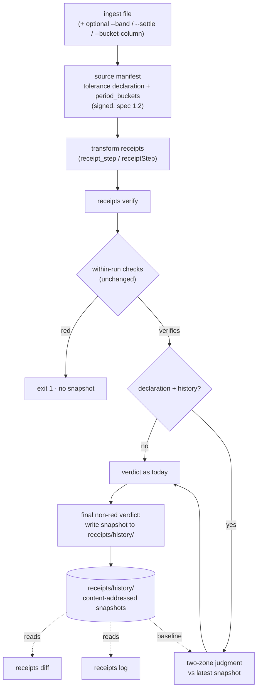
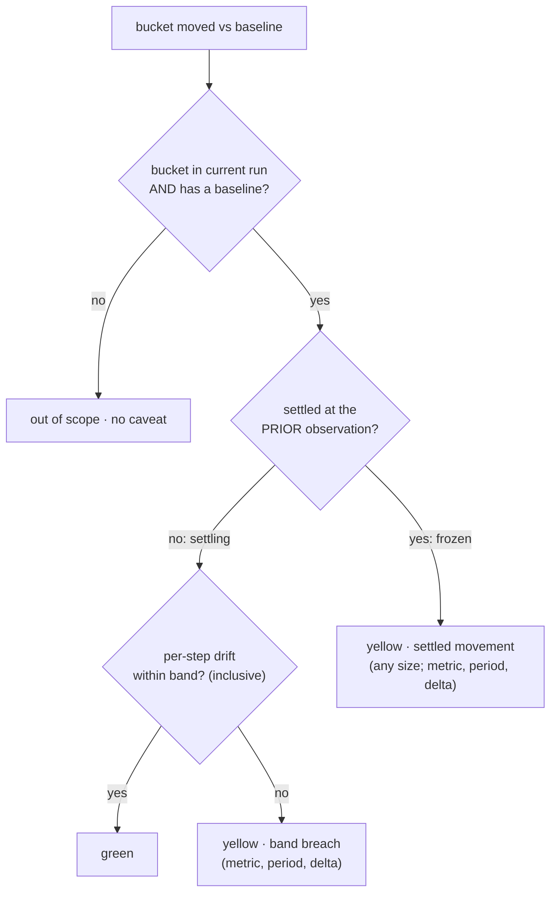

# feat: Period-over-period continuity (diff, log, tolerance bands)

## Summary

Give the receipt chain a memory and a sense of normal: `receipts diff` and `receipts log` over automatically archived run snapshots, plus opt-in tolerance declarations signed into the source manifest and judged with a two-zone model (maturing buckets may drift inside the band; settled buckets are frozen). Receipts gain per-period bucketed control totals (spec 1.1 to 1.2), both stacks reach parity, and out-of-the-box verification stays exact (see origin: docs/brainstorms/2026-06-11-period-over-period-continuity-requirements.md).

---

## Problem Frame

Reporting exports drift on purpose for 24 to 48 hours, then settle. Verification today is a sameness check, so "different from yesterday" carries no signal for scheduled refreshes, and `--warn-drift` ships off by default because it would fire daily. Receipts accumulate control totals on every run, but no diff, history, or trend primitive exists in either stack. The product's worst failure mode is a false yellow: a trust tool that cries wolf on normal drift gets muted.

---

## Requirements

Carried from the origin doc (R1 to R15) and extended by plan-level requirements (R16 to R19). Origin AE1 to AE6 are preserved; this plan adds AE7 to AE14.

**Memory: diff, log, and run history**

- R1. `receipts diff` compares two runs and reports, per stage: code-hash changes and the control-totals delta (row counts, numeric sums, null counts, date ranges). Works with or without tolerance declarations.
- R2. Every CLI-verified run with a non-red final verdict archives a compact totals snapshot automatically.
- R3. `receipts log` renders archived history as a per-metric trend across runs (day, week, month, quarter granularity).
- R4. Diff and log are read-only; they never modify chains, receipts, or archived snapshots.

**Tolerance declarations**

- R5. A producer may declare tolerance at ingest: a band (default 5% day-over-day) and a settling window (default 72h). The declaration lives in the source manifest, covered by its signature.
- R6. With no declaration present, verification is exact and unchanged from current behavior.
- R7. Verification honors only bands sourced from the signed chain; changing a declaration requires re-ingest.
- R8. The declared band applies to all tracked control-totals metrics uniformly.

**Two-zone judgment**

- R9. With a declaration and history present, cross-run comparison judges each period bucket: buckets inside the settling window may drift within the band (green); beyond the band trips yellow.
- R10. Settled buckets are frozen: any movement, at any size, trips yellow with a caveat naming the period and delta.
- R11. Two-zone judgment requires per-period bucketed control totals keyed off the data's bucket column. Datasets without one fall back to the flat band over whole-table totals.
- R12. Cross-run anomalies never produce red; red stays reserved for a broken chain or within-run data mismatch.
- R13. Band-breach and settled-movement caveats are distinct types naming metric, period, and delta.

**Cross-stack, spec, and safety**

- R14. Python and JS reach parity: same commands and semantics; bucketed totals, bucket keys, and band arithmetic join the golden vectors; spec bumps with fixtures regenerated in the same change.
- R15. New caveat copy follows `docs/MESSAGING.md`: fixed verdict lines, no em dashes, no accuracy or correctness claims.
- R16. A golden-vector generator script is committed (the 1.0 to 1.1 bump regenerated vectors ad hoc; this bump fixes that).
- R17. False-yellow protections are built into the judgment rules: zone classified at prior observation, absent buckets out of scope, no-baseline buckets never judged, source-identity mismatch skips judgment with a notice.
- R18. The `--json` payload changes are additive only: `caveats` stays a flat string array; typed detail lands in a new `caveat_details` array. The AGENTS.md schema doc is updated to match.
- R19. Existing 1.1 chains verify green under 1.2 verifiers in both stacks; history writes never alter a verdict or fail a verify (degrade with a notice on read-only filesystems).

---

## Key Technical Decisions

**Bucketing and spec**

- **Bucketing-only date-string rule:** for bucket-column detection, a column qualifies when at least 90% of non-null values are typed dates *or* ISO-shaped date strings. Canonicalization is untouched, so semantic hashes do not move; without this, CSV (the dominant format, and the only JS path) can never produce buckets because `_try_date` counts typed values only (`tamper_signal/totals.py:40-49`).
- **Bucket column selection:** exactly one qualifying column means use it; multiple means require `--bucket-column` in the signed declaration, else no buckets plus a notice; none means flat-band fallback (R11).
- **Day buckets keyed on the canonical UTC date string**, matching `canonical.py`'s date normalization, so both stacks and the vectors agree byte-for-byte.
- **Buckets are a sibling key under control totals** (`period_buckets`), inert to the browser badge, which iterates `numeric_sums`/`null_counts` keys only (`badge/badge.js` `totalsDelta`).
- **Spec bump is documentation plus fixture regeneration, not version-gated code:** nothing branches on `spec_version` today; checks stay field-presence-driven. Both `SPEC_VERSION` constants bump (`tamper_signal/__init__.py:18`, `node/receipts.js:13`).

**Snapshots and history**

- **Snapshot carries per-stage code identity** (`{name, code_hash, code_file, totals}` per stage) plus source identity (filename, declared origin, column set), chain tail hash, and spec version. Refreshes overwrite the chain in place, so the snapshot is the only durable record of the prior run; without code hashes in it, `diff` cannot answer "did the code change?" (origin F3).
- **`receipts diff` defaults to current chain vs latest snapshot;** explicit arguments accept chain dirs or snapshot files. Stage alignment is by name, with unmatched stages listed rather than misaligned.
- **Content-addressed always, signed when a key is present:** snapshot filename derives from the body hash (idempotent under concurrent verifies); a producer key (`--key`/`TAMPER_SIGNAL_KEY`/default path) additionally signs it. A consumer verifying a published chain holds no private key, so "signed" cannot be unconditional. History is honestly weaker evidence than the chain.
- **Snapshot written by CLI verify only, on the final non-red verdict, after the anchor fold** (`tamper_signal/cli.py:164-197` mutates the exit code late). A red run never poisons baselines. Idempotence: skip the write when the latest snapshot has the same chain tail hash.
- **Memory-gap mitigations:** `rebuildChain` gets a post-stages snapshot hook (JS programmatic users never touch the CLI); Python ingest warns when resetting a chain that has no snapshot at its tail.
- **`receipts serve` excludes `history/`;** the Express middleware already serves flat files only (`node/express.js:33-46`). Published receipts now carry daily-granularity buckets, which docs must disclose.

**Judgment rules**

- **Judgment anchors on the source manifest's buckets** (where the declaration also lives). Transforms can legitimately destroy the date column (group-by-month), and within-run link checks already cover downstream stages.
- **Two baselines:** settling buckets are judged per-step against the previous snapshot (compounding drift does not accumulate against the band); a settled bucket's baseline is its value in the first snapshot taken after it exited the window (drift cannot ratchet forever, either).
- **Zone classified at prior observation:** the frozen rule applies only when the bucket was already settled at the last snapshot. A bucket that matured between runs while crossing the boundary is band-judged, not frozen (kills the guaranteed boundary-straddle false yellow). Bucket age measures from bucket end (end of day, UTC) against the current run's `created_at`; exactly at the window is settling (inclusive).
- **Scope rules (R17):** buckets absent from the current run are out of scope (rolling 30-day exports must not alarm daily); buckets with no baseline are never judged; source-identity mismatch skips judgment with one notice; bucket-column identity change skips with its own typed caveat.
- **Band math in decimal strings, never floats** (matching `totals.py`); exactly at the band is green (inclusive); zero-baseline movement is a defined breach reported with the absolute delta; 0 to 0 is green. Boundary cases join the shared band vectors.
- **Caveat flood control:** one caveat string per metric, naming bucket count and worst delta; full per-bucket detail lives in `caveat_details`. A provider restatement touching 30 buckets must not emit 120 caveat lines.
- **Mixed 1.1/1.2 pairs** (old snapshot without buckets, or 1.1 source receipt) fall back to the flat band for that comparison, with a notice.

---

## High-Level Technical Design

Run lifecycle with the new components:

Two-zone bucket judgment (the refined rule, with the prior-observation zone classification):

---

## Implementation Units

### Phase A — Spec 1.2 foundation

### U1. Per-period bucketed totals and spec bump (Python)

- **Goal:** Receipts carry `period_buckets` under control totals; spec version becomes 1.2; fixtures and golden vectors regenerate from a committed generator.
- **Requirements:** R11, R14, R16, R19
- **Dependencies:** none
- **Files:** `tamper_signal/totals.py`, `tamper_signal/__init__.py`, `scripts/make_vectors.py` (new), `examples/make_demo_chains.py`, `examples/chains/` (regenerated), `node/test/vectors.json` (regenerated), `tests/test_tamper_signal.py`
- **Approach:** Bucket-column detection in `totals.py` extends the 90% rule to ISO-shaped date strings for bucketing only; `control_totals()` gains `period_buckets: {iso_date: {row_count, numeric_sums, null_counts}}` plus a `bucket_column` name. Canonicalization untouched. `SPEC_VERSION = "1.2"` with the convention comment block. The new `scripts/make_vectors.py` emits `node/test/vectors.json` entries including bucket-key cases (typed date, ISO string, midnight-datetime collapse).
- **Execution note:** Regenerate fixtures and vectors in the same commit as the constant bump, per `docs/solutions/logic-errors/numeric-text-canonicalization-cross-format-hash-mismatch.md`.
- **Patterns to follow:** the 1.1 bump (commit 6bdbd99) touched constant + behavior + fixtures together; `_TYPE_THRESHOLD` handling in `totals.py:24`.
- **Test scenarios:**
  - Happy: xlsx with typed dates produces buckets; CSV with ISO date strings produces identical buckets (same data, same bucket keys).
  - Happy: semantic hash of the same data is unchanged from 1.1 (bucketing does not move hashes).
  - Edge: date column under 90% threshold produces no buckets; multiple qualifying columns produce no buckets without a declared column; bare-date vs midnight-datetime rows land in the same bucket.
  - Edge: existing 1.1 fixture chains still verify green (backward compat, R19).
  - Covers AE5. CSV with no date-shaped column yields no buckets.
- **Verification:** pytest green; regenerated `examples/chains/` verify green; vectors file diff reviewed.

### U2. Bucket parity in Node

- **Goal:** `node/totals.js` produces byte-identical `period_buckets`; Node spec constant bumps; vectors pass.
- **Requirements:** R11, R14
- **Dependencies:** U1
- **Files:** `node/totals.js`, `node/receipts.js` (SPEC_VERSION), `node/test/totals.test.js`, `node/test/canonical.test.js`
- **Approach:** Mirror U1's detection and bucket shape with the existing BigInt decimal-string math. The regenerated `vectors.json` from U1 is the contract.
- **Test scenarios:**
  - Happy: vectors byte-equality including bucket-key entries.
  - Happy: CSV loaded via `loadCsv` produces buckets identical to Python's for the same file.
  - Edge: `node/test/interop.test.js` still verifies the regenerated Python-signed fixtures green/red/yellow.
- **Verification:** `npm test` green across the file list in `package.json` scripts.

### Phase B — Declaration and memory

### U3. Tolerance declaration at ingest (both stacks)

- **Goal:** `--band`, `--settle`, and `--bucket-column` flags record a signed `tolerance` field in the source manifest; absent flags mean absent field.
- **Requirements:** R5, R6, R7
- **Dependencies:** U1, U2
- **Files:** `tamper_signal/cli.py`, `tamper_signal/receipts.py` (`build_source_manifest`), `node/cli.js`, `node/wrapper.js` (`ingestFile` options), `node/receipts.js` (`buildSourceManifest`), `tests/test_cli_agent_ergonomics.py`, `node/test/pipeline.test.js`
- **Approach:** New top-level `tolerance: {band, settle_hours, bucket_column?}` in the manifest body is automatically signature-covered (`_sign_body` canonicalizes the whole body). Parse `5%`/`0.05` band forms and `72h` durations; reject invalid values at ingest with exit 1. `--band` alone implies the 72h default; `--settle` alone implies the 5% default.
- **Patterns to follow:** `cmd_ingest` arg threading (`cli.py:51-80`, parser 539-545); `TAMPER_SIGNAL_KEY` precedence notice.
- **Test scenarios:**
  - Happy: ingest with `--band 5%` writes a signed manifest whose tolerance field survives verification; chain without flags has no `tolerance` key and verifies byte-identically to today.
  - Edge: invalid band (`-3%`, `banana`) exits 1 with a named error; `--bucket-column` naming a column that fails detection exits 1.
  - Covers AE4. No declaration leaves verify behavior unchanged.
- **Verification:** both CLIs round-trip the declaration; signature verification fails if the tolerance field is edited by hand.

### U4. Run snapshots and the history directory (both stacks)

- **Goal:** Non-red CLI verifies archive a content-addressed (and, when a key is present, signed) snapshot to `receipts/history/`; programmatic JS rebuilds hook in; serve excludes history.
- **Requirements:** R2, R4, R17 (source identity), R19
- **Dependencies:** U1, U2
- **Files:** `tamper_signal/receipts.py` (snapshot build/read), `tamper_signal/cli.py` (`cmd_verify`, `cmd_ingest` warning, `cmd_serve` exclusion), `node/receipts.js`, `node/cli.js`, `node/wrapper.js` (`rebuildChain` hook), `tests/test_tamper_signal.py`, `node/test/` (new `history.test.js`, added to `package.json` scripts.test)
- **Approach:** Snapshot body: `{spec_version, created_at, chain_tail_hash, source: {filename, declared_origin, columns}, tolerance?, stages: [{name, code_hash, code_file, totals}]}`. Filename from the body hash (concurrent-safe, idempotent). Write sits after the anchor fold in both text and JSON branches so a late red never leaves a snapshot. Skip when the latest snapshot shares the tail hash. Write failures degrade to a stderr notice, never a verdict change. `rebuildChain` snapshots after its stages complete (it holds key and totals). `cmd_ingest` warns when resetting a chain with no snapshot at its tail.
- **Test scenarios:**
  - Happy: green verify writes exactly one snapshot; re-verify of the same chain writes none; yellow (caveats) verify still writes.
  - Error: red verify writes nothing (covers AE12); read-only history dir leaves verdict and exit code unchanged with a notice (covers AE10).
  - Edge: snapshot signed when key present, unsigned-but-content-addressed when not; `receipts serve` returns 404 for `history/` paths; `read_receipt` confinement regression (history files cannot be smuggled into chain.json).
  - Integration: Python-written snapshot is read and verified by the JS CLI and vice versa.
- **Verification:** snapshots round-trip cross-stack; doctor and serve behave; no verdict regressions in existing tests.

### Phase C — Commands and judgment

### U5. `receipts diff` (both stacks)

- **Goal:** Compare two runs (chain dirs, snapshot files, or default current-vs-latest-snapshot) and report per-stage code-hash changes plus a structured totals delta including date ranges.
- **Requirements:** R1, R4
- **Dependencies:** U4
- **Files:** `tamper_signal/cli.py` (`cmd_diff`), `tamper_signal/totals.py` (structured delta helper), `node/cli.js` (`cmdDiff`), `node/totals.js`, tests in both stacks
- **Approach:** New structured delta function covering row_count, column_count, numeric_sums, null_counts, and date_ranges; the existing `totals_delta` string output stays untouched (it feeds the red report and documented JSON). Stages align by name; unmatched stages render as added/removed. Human output plus `--json`.
- **Patterns to follow:** `cmd_export` defensive chain loading (`cli.py:385-424`); Node command table registration (`node/cli.js:250-256`) and USAGE block.
- **Test scenarios:**
  - Happy: code change at one stage names that stage and the hash change; totals movement renders per-stage deltas including date-range extension.
  - Happy: default invocation with no args compares the current chain to the latest snapshot.
  - Edge: stage lists of different lengths align by name; chains with different sources are compared with the identity mismatch noted; empty history with default invocation exits with a clear message.
  - Covers F3 (settled change: diff shows whether code also moved).
- **Verification:** diff of the committed `intact` vs `tampered` example chains names the tampered stage and delta.

### U6. Two-zone cross-run judgment in verify (both stacks)

- **Goal:** With declaration plus history, verify judges source-manifest buckets under the two-baseline, prior-observation-zone rules and emits typed, flood-controlled yellow caveats; `--json` gains additive `caveat_details`.
- **Requirements:** R8, R9, R10, R12, R13, R15, R17, R18
- **Dependencies:** U3, U4
- **Files:** `tamper_signal/receipts.py` (`verify_chain` keyword input + judgment), `tamper_signal/totals.py` (band math), `tamper_signal/cli.py` (history load, payload), `node/receipts.js` (`verifyChain` options), `node/cli.js`, shared band vectors fixture (`tests/fixtures/band_vectors.json`, consumed by both stacks), tests in both stacks
- **Approach:** Judgment hooks into verify's section-4 caveat block after `warn_drift` (`receipts.py:501-508` precedent), fed by keyword-only history/tolerance inputs; CLI loads the latest valid snapshot and passes it in. Baselines and zone classification per KTDs. Decimal-string band math with inclusive boundary. One caveat string per metric (count + worst delta); full detail in `caveat_details: [{type, metric, period, before, after, delta}]`. Anchor-fold caveats carry no typed detail; counts may differ by design and the schema doc says so. Unverifiable or tampered snapshots are skipped with a notice, never red.
- **Execution note:** Build the shared band-vector fixture first and implement against it test-first; both stacks must read the same fixture.
- **Test scenarios:**
  - Covers AE1. +4.8% on a settling bucket under a 5% band: green, no caveat.
  - Covers AE2. +9%: yellow, band-breach caveat naming metric, period, delta; negative drift (-9%) equally.
  - Covers AE3. Settled bucket row_count changes by 1: yellow settled-movement caveat.
  - Covers AE6. Cross-run yellow plus within-run red: red wins, judgment never runs or is discarded.
  - Covers AE7. Exactly +5.000%: green (inclusive boundary, from the shared vectors).
  - Covers AE8. Bucket present in history, absent from the current run (rolling window): no caveat.
  - Covers AE9. Bucket that crossed the settling boundary between runs and drifted while maturing: green (zone from prior observation).
  - Covers AE11. Garbage or signature-failing snapshot in history: skipped with notice, verdict from remaining checks.
  - Covers AE13. History present, no declaration: verdict and JSON identical to today except the additive key.
  - Covers AE14. 1.1 snapshot (no buckets) under a 1.2 run: flat-band comparison with a notice.
  - Edge: zero-baseline (0 to n) reported as breach with absolute delta; 0 to 0 green; first run ever with declaration is green with zero caveats; restatement touching 30 buckets emits one caveat per metric; same-bucket breach on two metrics emits two caveats; out-of-order verify (older chain than latest snapshot) skips with notice; source-identity mismatch skips with notice; key-rotated history verifies under repeated `--pub`.
  - Integration: Python writes history, JS verify emits identical `caveat_details` JSON, and the reverse.
- **Verification:** exit codes hold (0/2/1); existing AGENTS.md CI recipe (string-join of `caveats`) still works; PYTHONUTF8 Windows output clean.

### U7. `receipts log` (both stacks)

- **Goal:** Render per-metric trends across archived runs at day/week/month/quarter granularity.
- **Requirements:** R3, R4
- **Dependencies:** U4
- **Files:** `tamper_signal/cli.py` (`cmd_log`), `node/cli.js` (`cmdLog`), tests in both stacks
- **Approach:** Read-only scan of `receipts/history/`; default table of run timestamp vs key metrics (row_count plus declared or detected numeric sums); `--granularity` collapses multiple runs per period, last-wins; `--metric` filters. Mixed-version history renders whole-table metrics for all snapshots and bucketed detail only where present. Plain table first; no sparklines in v1.
- **Test scenarios:**
  - Happy: three archived runs render three rows with correct deltas.
  - Edge: empty history says so and exits 0; single run renders without deltas; two runs in one day collapse last-wins at day granularity; unsigned snapshots render with a weaker-evidence marker.
- **Verification:** output stable under `PYTHONUTF8`; both CLIs agree on collapse behavior.

### Phase D — Docs and contract surface

### U8. Documentation and contract updates

- **Goal:** Every documented contract that this feature touches is updated in the same release.
- **Requirements:** R15, R18
- **Dependencies:** U3, U5, U6, U7
- **Files:** `AGENTS.md` (JSON schema, Python-vs-JS parity table, runbook step for declarations and history), `README.md` (CLI section), `docs/cli.html` and `docs/advanced.html` (on-site docs: new commands, flags, caveat types), `docs/MESSAGING.md` (caveat taxonomy list), `CONCEPTS.md` (Snapshot, Run history entries), `llms.txt`
- **Approach:** Additive schema documentation for `caveat_details`; parity table gains `diff` and `log` rows; disclosure note that published receipts now carry daily-granularity buckets; caveat copy review against MESSAGING rules (settled-movement copy points the reader at `receipts diff`, names the producer's declaration, no em dashes).
- **Test expectation: none** -- documentation-only unit; correctness is reviewed against shipped behavior from U3 to U7.
- **Verification:** AGENTS.md schema matches actual `--json` output byte-for-byte for a sample run; on-site docs render (existing static pattern).

---

## Acceptance Examples

Origin AE1 to AE6 carry forward unchanged (see origin doc). New, from flow analysis:

- AE7. **Covers R9.** Given a 5% band, when a settling bucket moves exactly +5.000%, then the light is green (inclusive boundary).
- AE8. **Covers R17.** Given a rolling 30-day export, when yesterday's refresh drops the oldest settled bucket, then no caveat is emitted.
- AE9. **Covers R17.** Given a bucket that was settling at the last snapshot and settled since, when it drifted within the band before settling, then the light is green.
- AE10. **Covers R19.** Given a read-only receipts dir, when verify cannot write a snapshot, then the verdict and exit code are unchanged and a notice goes to stderr.
- AE11. **Covers R19.** Given a tampered or unverifiable snapshot in history, when verify runs, then that snapshot is skipped with a notice and the verdict is never red because of it.
- AE12. **Covers R2, R12.** Given a within-run red, when verify completes, then no snapshot is written.
- AE13. **Covers R6.** Given history exists but no declaration, when verify runs, then verdict and JSON match today's output except the additive `caveat_details` key.
- AE14. **Covers R11.** Given a 1.1-era snapshot without buckets, when a 1.2 run is judged, then the flat band applies to whole-table totals with a notice.

---

## Scope Boundaries

**Deferred for later** (carried from origin)

- `suggest-bands` helper proposing a declaration from accumulated history.
- Browser trend/history view; band-breach caveats surface through existing yellow-caveat rendering in v1. History stays CLI-local (Express middleware already confines to flat files).
- Per-metric band overrides and absolute floors (small-bucket percent noise is documented, not solved, in v1).
- Alerting, webhooks, scheduled re-verification; fleet roll-ups.

**Outside this product's identity** (carried from origin)

- Statistical or learned anomaly detection acting as a judge; verdicts must be reproducible from signed declarations alone.
- Any claim of accuracy or correctness; bands are the producer's declared expectation of continuity.

**Deferred to follow-up work** (plan-local)

- Snapshot mini-chain (each snapshot recording the prior snapshot's hash) for cheap history tamper evidence; decide during U4 implementation if cost is trivial, else follow up.
- `receipts doctor` checks for history presence/size and un-snapshotted resets.
- History retention/pruning: v1 is unbounded and documented (~365 small files/year at daily cadence).
- Anchoring snapshots in the transparency log.

---

## Risks & Dependencies

- **Spec bump regression risk.** Mitigation: regenerated fixtures and vectors in the same commit (U1), backward-compat tests asserting 1.1 chains verify green in both stacks (R19), and the committed generator (R16) making the next bump reproducible.
- **False-yellow residuals.** Timezone/DST edge-row migration between adjacent buckets and small-denominator percent noise remain possible on legitimate data. Mitigation: bucket on canonical UTC date strings; document the paired-adjacent-bucket signature in caveat docs; settled-movement copy points at `receipts diff` so the user can resolve instead of muting.
- **History is weaker evidence than the chain.** Snapshots sit outside `receipt_hashes` and anchoring; an attacker who can edit data may also edit history. Documented honestly in U8; mini-chain deferred.
- **Documented JSON schema compatibility.** AGENTS.md publishes the verify schema and a CI recipe joining `caveats`; all changes are additive (R18) and U8 updates the doc in the same release.
- **Receipt size growth.** 90-day exports add ~90 buckets per metric to the source manifest; check vector and badge fetch sizes during U1 (badge is inert to the key but still downloads it).
- **Windows CI output.** New CLI glyphs follow the existing `PYTHONUTF8: "1"` accommodation.

---

## Open Questions

**Deferred to implementation**

- Whether the snapshot mini-chain lands in U4 or follow-up (trivial-cost test during implementation).
- Exact `receipts log` column layout and metric selection defaults once real history renders.
- Whether `--settle` accepts units beyond hours (`3d`); parse surface decided at U3.

---

## Sources & Research

- Origin: `docs/brainstorms/2026-06-11-period-over-period-continuity-requirements.md`.
- Verify caveat hook and warn_drift precedent: `tamper_signal/receipts.py:493-524`; exit-code mapping and JSON payload: `tamper_signal/cli.py:142-197`.
- Totals shape, 90% type threshold, typed-date detection, delta strings: `tamper_signal/totals.py` (`control_totals` 52-113, `totals_delta` 116-166, `_try_date` 40-49).
- Manifest signing covers new fields automatically: `tamper_signal/receipts.py:52-93`; Node mirror `node/receipts.js:39-65`.
- Chain reset points: `tamper_signal/cli.py:71-72` (ingest), `node/wrapper.js:99-146` (`ingestFile`, `rebuildChain`).
- History dir safety: `read_receipt` confinement `tamper_signal/receipts.py:200-203`; Express flat-file confinement `node/express.js:33-46`; `receipts serve` serves subdirs (`tamper_signal/cli.py:360-382`) hence the exclusion.
- Spec bump precedent and ritual: commit 6bdbd99 (1.0 to 1.1), `docs/solutions/logic-errors/numeric-text-canonicalization-cross-format-hash-mismatch.md`; golden vectors consumed at `node/test/canonical.test.js`; no committed generator existed before this plan.
- Three-verifier lockstep warning: `node/receipts.js:241-247`; badge inert to sibling keys (`badge/badge.js` `totalsDelta`).
- Copy rules: `docs/MESSAGING.md` (locked verdict lines, banned words, no em dashes); AGENTS.md hard rules and documented schema (step 5).
- Flow and edge-case analysis: settling-boundary straddle, rolling-window disappearance, baseline accumulation, source-identity mismatch, zero-baseline math (this plan's KTDs R17 and judgment rules respond point-for-point).
