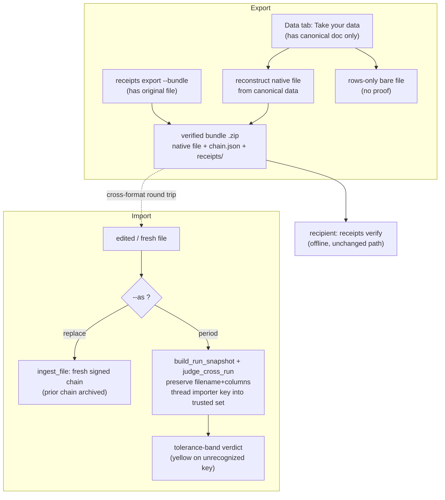

# feat: Data portability — verified export and import

## Summary

Add a client-side "Take your data" export to the browser Data tab (a verified zip
bundle or a bare rows-only file) and a re-ingest import in two modes (replace and
append-period), across both the Python and JS implementations. Ship with a
round-trip demo, a data-portability blog post, and a docs sweep. Builds on shipped
primitives — `cmd_export`'s refuse-on-mismatch guard, `mountReceiptTable`,
`ingest_file`/`ingestFile`, and the period-over-period snapshot/judgment machinery.

---

## Problem Frame

Every BI tool lets you download a CSV; none let you take the *proof* with the data.
At the export button, the chain's trust evaporates and the data becomes an
unattested blob. Tamper Signal's Semantic hash is format-agnostic, so the same data
exported as CSV and re-verified as JSON yields the same hash and a green light —
that round-trip is the differentiator, and it already works at the CLI. What's
missing are the *surfaces*: export is CLI-only and JSON-only, the browser table has
no download affordance, and import has no first-class entry point beyond a raw
`ingest`. This assembles the existing pieces into a portability story a user can see
and a post can argue.

---

## Requirements

Carried from origin (`see origin: docs/brainstorms/2026-06-14-data-portability-export-import-requirements.md`),
with two integrity requirements (R16, R17) added from research. R-IDs are regrouped
by capability here; the origin↔plan mapping is: origin R5→R3, origin R3→R4, origin
R4→R5, origin R9→R8, origin R8→R9 (all others unchanged). Acceptance Example coverage
below uses plan R-IDs.

**Export**

- R1. The Data tab offers a "Take your data" export with two outputs: a verified
  bundle and a bare rows-only file.
- R2. Export produces csv/tsv/json/ndjson client-side; xlsx is produced via the
  Python path.
- R3. Export covers the full attested table and reuses the existing guard that
  refuses data whose Semantic hash does not match the final receipt.

**Verified bundle**

- R4. A verified bundle is a zip containing the native data file, `chain.json`, and
  the `receipts/` directory.
- R5. A recipient re-verifies a bundle offline with `receipts verify`, with no change
  to the verification path.
- R6. A rows-only export is the bare native file with no proof; the UI makes the
  difference legible at the point of choice.

**Import**

- R7. Import in replace mode re-ingests the file as a new source, signing a fresh
  chain.
- R8. Import in append-period mode records the file as the next run snapshot and
  judges drift against prior snapshots through the declared tolerance bands.
- R9. Replace archives the prior chain rather than silently overwriting it.

**Honesty and re-attestation**

- R10. Every import records who re-attested and when; re-attestation is never silent.
- R11. Import never launders unverified data into a green chain: imported data is
  attested under the importer's identity, and the verdict reflects that identity (an
  unrecognized key stays yellow).

**Naming and content**

- R12. The CLI keeps `receipts export` and `receipts ingest`; the plain-register UI
  and blog use "Take your data" / "verified export." All copy obeys
  `docs/MESSAGING.md`.
- R13. A data-portability blog post argues the stance using the cross-format
  round-trip as proof.
- R14. A round-trip demo shows export as CSV, re-verify as JSON, light stays green.
- R15. README, on-site docs, CHANGELOG, llms.txt, and the FAQ cover export, import,
  and the verified bundle.

**Cross-stack integrity (research-added)**

- R16. Every export/import format reproduces identical Semantic hashes across
  formats, covered by the cross-format identical-hash test and golden vectors.
  csv/tsv/json/ndjson and the browser-reconstructed files are verified across both
  the Python and JS implementations; xlsx is Python-only and verified single-runtime.
- R17. Bundle export and import preserve receipt bytes exactly (LF line endings, no
  re-serialization on import), verified through the real CLI verify path including a
  Windows round-trip.

---

## Key Technical Decisions

- **Import is a CLI/library operation, not in-browser signing.** The site is static
  with no server; signing needs the private key and disk writes. Import lives in the
  `receipts` CLI and the Python/JS libraries. The dashboard's role is at most to
  surface the command, never to re-sign in the browser.

- **Two export producers with different fidelity, both honest.** The CLI
  (`receipts export --bundle`) has the original file on disk and includes it verbatim.
  The browser "Take your data" has only the canonical table doc, so it reconstructs a
  native-format file from canonical data — column/row-sorted and normalized. Copy
  states plainly that the browser export is the *attested data*, not the original file
  byte-for-byte or in original row order.

- **Replace extends the existing ingest reset; append-period is built new.** Replace
  maps onto `ingest_file`/`ingestFile`, which already reset `chain.json` to a fresh
  signed source. Append-period has no direct primitive — it is built on
  `build_run_snapshot` + `judge_cross_run`, threading the importer's public key into
  the trusted set and computing the `breached` baseline guard into the archived
  snapshot (mirroring JS `rebuildChain`).

- **Append-period continuity keys on source identity, not signing key.** Cross-run
  judgment matches on `run_source` (filename + column set). Append-period is
  recognized as a continuation only when the imported file preserves the prior run's
  filename and columns; a renamed or reshaped file is treated as a new source. The
  signing key may rotate freely — the importer's key is added to the trusted set so
  its snapshot is judged, and a key the next verifier doesn't recognize surfaces as a
  yellow caveat, never a silent green.

- **Import mode is a flag on `ingest`, defaulting to replace.** `receipts ingest
  <file> --as replace|period`; bare `ingest` stays replace for back-compat. Export
  bundle is `receipts export --bundle`; bare `export` still writes `table.json`.

- **Client-side zip is a hand-rolled store-only writer, no dependencies.** The
  `node/` and browser code carry zero runtime deps; a minimal stored-entry (no
  compression) zip writer preserves that posture and gives byte control needed for
  LF-exact receipt files. Exact bytes deferred to implementation.

- **Any canonicalization touch is a spec bump.** If wiring import or a new loader
  changes canonical output, bump `SPEC_VERSION` and regenerate golden vectors and
  fixtures in the same change. The goal is to add formats to the existing canonical
  path without changing it.

---

## High-Level Technical Design

The round-trip proof: a CSV exported from the bundle, re-ingested/verified as JSON,
produces the same Semantic hash and a green light.

---

## Implementation Units

Phased: Export (U1–U3), Import (U4–U6), Integrity gate (U7), Demo & content (U8–U10).

### U1. CLI verified-bundle export

- **Goal:** `receipts export --bundle` writes a zip of the original data file plus
  `chain.json` and `receipts/`, alongside the existing `table.json` output.
- **Requirements:** R3, R4, R5, R17
- **Dependencies:** none
- **Files:** `tamper_signal/cli.py` (`cmd_export`, export subparser), `tests/test_cli_agent_ergonomics.py`
- **Approach:** Extend `cmd_export` with a `--bundle` path. Reuse the refuse-on-mismatch
  guard unchanged. Write receipt and chain files into the zip with their exact
  on-disk bytes (LF preserved), and include the original `--data` file verbatim.
  Bare `export` behavior is unchanged.
- **Patterns to follow:** the existing `cmd_export` guard and `--out` handling; LF
  byte discipline from the Windows autocrlf learning.
- **Test scenarios:**
  - Happy path: `--bundle` on an intact chain produces a zip whose unzipped contents
    pass `receipts verify`. Covers AE2.
  - Edge: original `--data` is xlsx — included verbatim in the bundle.
  - Error: data mismatches the final receipt — refused, no zip written. Covers AE1.
  - Integration: bundle written on one OS verifies after unzip on Windows (byte/LF
    preservation). Covers R17.
- **Verification:** unzip + `receipts verify chain.json` is green; `export` without
  `--bundle` still writes only `table.json`.

### U2. Browser "Take your data" export

- **Goal:** A control in the Data tab that downloads either a verified bundle
  (reconstructed native file + chain + receipts) or a bare rows-only file, in
  csv/tsv/json/ndjson, built client-side.
- **Requirements:** R1, R2, R6, R4
- **Dependencies:** U1 for bundle-shape parity only — the zip shape is fixed by R4,
  so U2 can proceed in parallel with U1 and shape parity is validated in U7.
- **Files:** `badge/table.js` (`mountReceiptTable` footer/strip, new exporter), `badge/table.d.ts`, `tamper_signal/static/table.js` (synced copy), `tests/test_integrations.py`, `node/test/` (exporter unit)
- **Approach:** Add a format picker + download to the existing `tt-foot`/`tt-strip`.
  Reconstruct the native file from the in-scope verified `doc` using `canonicalize`;
  build the zip with the hand-rolled store-only writer from the already-fetched
  `chain.json` and receipt bytes. Rows-only emits the bare reconstructed file with
  copy marking it unverified. xlsx is not offered client-side (routed to the Python
  path in copy).
- **Patterns to follow:** `injectTableStyles`, the "show all" footer control, and
  the existing `canonicalize`/`outputHashOf` imports.
- **Execution note:** after editing `badge/table.js`, copy to
  `tamper_signal/static/table.js` — `test_integrations.py` enforces byte-identity.
- **Test scenarios:**
  - Happy path: verified-bundle download contains chain + receipts + a native file
    that re-verifies. Covers AE2.
  - Happy path: rows-only download is the bare file with no chain/receipts. Covers AE4.
  - Edge: each of csv/tsv/json/ndjson reconstructs and re-verifies.
  - Edge: xlsx is absent from the client-side picker.
  - Integration: `test_integrations.py` byte-identity guard passes after sync.
- **Verification:** a downloaded bundle unzips and verifies; rows-only is clearly
  labeled unverified in the UI.

### U3. JS library export parity

- **Goal:** `node` `export --bundle` produces the same verified bundle shape as the
  Python CLI.
- **Requirements:** R4, R16, R17
- **Dependencies:** U1
- **Files:** `node/cli.js` (`cmdExport`, dispatch table, USAGE), `node/wrapper.js` (or a small export helper), `node/test/pipeline.test.js`
- **Approach:** Mirror U1 in the JS CLI using the store-only zip writer; include the
  original file verbatim. Keep bundle bytes parity with Python where it affects
  hashing (the receipts and chain are the same files).
- **Patterns to follow:** `cmdExport` at `node/cli.js`, the parseArgs-per-command
  pattern, USAGE lines.
- **Test scenarios:**
  - Happy path: JS-produced bundle verifies with the Python CLI and vice versa.
  - Edge: csv/tsv/json/ndjson round-trip; xlsx export rejected in JS with the
    existing "use the Python CLI" message.
- **Verification:** cross-runtime bundle verify is green both directions.

### U4. Append-period core (Python)

- **Goal:** A library function that records an imported file as the next run snapshot
  and judges it against prior snapshots via tolerance bands, under the importer's key.
- **Requirements:** R8, R10, R11
- **Dependencies:** none
- **Files:** `tamper_signal/wrapper.py`, `tamper_signal/history.py`, `tests/test_run_history.py`, `tests/test_judgment.py`
- **Approach:** Compose `build_run_snapshot` + `judge_cross_run`. Preserve
  `run_source` filename + columns so judgment recognizes continuity. Add the
  importer's public key to the snapshot's trusted set and compute the `breached`
  baseline guard into the archived snapshot. Re-attestation identity (who/when) is
  recorded in the snapshot/receipt.
- **Patterns to follow:** `archive_run_snapshot`, `_archive_after_verify`'s
  trusted-key handling, and the JS `rebuildChain` breached-threading at
  `node/wrapper.js`.
- **Test scenarios:**
  - Happy path: an in-band next-period import is judged within tolerance; light green.
  - Edge: settled-period movement raises the existing settled-movement caveat.
  - Edge: renamed/reshaped file → judged a new source, not a continuation.
  - Error/integration: import signed under an unrecognized key → yellow, never silent
    green. Covers AE3.
- **Verification:** judgment finds prior snapshots when filename+columns match; key
  change surfaces as a caveat.

### U5. Append-period core (JS)

- **Goal:** JS parity for append-period.
- **Requirements:** R8, R16
- **Dependencies:** U4
- **Files:** `node/wrapper.js` (extend `rebuildChain`/new entry), `node/history.js`, `node/test/history.test.js`, `node/test/judgment.test.js`, `node/test/vectors.json`
- **Approach:** Mirror U4 byte-for-byte on the judgment/snapshot path; extend golden
  vectors so cross-stack drift fails a test rather than producing a false verdict.
- **Patterns to follow:** `rebuildChain` at `node/wrapper.js`; the interop test
  conventions.
- **Test scenarios:**
  - Happy path / edges mirror U4 against the JS implementation.
  - Integration: golden-vector parity between Python and JS snapshots.
- **Verification:** `node --test` parity suite green; vectors regenerated if needed.

### U6. Import CLI surface

- **Goal:** `receipts ingest <file> --as replace|period` in both runtimes, defaulting
  to replace.
- **Requirements:** R7, R9, R10, R12
- **Dependencies:** U4, U5
- **Files:** `tamper_signal/cli.py` (`cmd_ingest`, ingest subparser), `node/cli.js` (`cmdIngest`, USAGE), `tests/test_cli_agent_ergonomics.py`
- **Approach:** `replace` calls the existing `ingest_file`/`ingestFile` reset; `period`
  calls U4/U5. Carry the existing unsnapshotted-reset warning. Bare `ingest` stays
  replace. Replace archives the prior chain before resetting.
- **Patterns to follow:** existing `cmd_ingest`, `_is_unsnapshotted_reset`,
  `TAMPER_SIGNAL_KEY` handling.
- **Test scenarios:**
  - Happy path: `--as replace` resets to a fresh signed chain; prior chain archived.
    Covers R7, R9.
  - Happy path: `--as period` routes to append-period judgment. Covers AE2/AE3.
  - Edge: bare `ingest` behaves exactly as today (replace).
  - Error: invalid `--as` value rejected with a clear message.
- **Verification:** both modes work in Python and JS with identical semantics.

### U7. Cross-format integrity gate

- **Goal:** Lock every export/import format to identical cross-format, cross-runtime
  hashes and byte-exact round-trips.
- **Requirements:** R16, R17
- **Dependencies:** U1, U2, U3, U6
- **Files:** `tests/test_tamper_signal.py` (`test_same_data_hashes_identically_across_formats`), `node/test/interop.test.js`, `node/test/vectors.json`, `scripts/make_vectors.py`, `.github/workflows/` (ensure windows-latest round-trip)
- **Approach:** Add csv/tsv/json/ndjson/xlsx and the rows-only reconstruction to the
  identical-hash loop and golden vectors. Add an export→import→`receipts verify`
  round-trip test that runs through the real CLI verify path (with
  recorded/actual hashes) on `windows-latest`.
- **Test scenarios:**
  - All formats hash identically across formats and runtimes. Covers R16.
  - Round-trip verify green on Windows; a CRLF/byte transform is caught as red.
    Covers R17.
  - Known caveat asserted: leading-zero / trailing-decimal collapse documented and
    tested as expected behavior.
- **Verification:** the gate fails on any new format omitted from the loop or any
  byte-level breakage.

### U8. Round-trip demo

- **Goal:** A demo fixture and page showing export-as-CSV → re-verify-as-JSON, light
  green.
- **Requirements:** R14
- **Dependencies:** U1, U6
- **Files:** `examples/make_demo_chains.py`, `examples/chains/` fixtures, a demo page under `docs/` or `index.html` section, `tamper_signal/demo.py` (if the demo command should emit a bundle)
- **Approach:** Extend the committed-fixture generator to produce a round-trip
  artifact. Reuse existing demo seeds/hashes (e.g., `shortHash("clean-out")`) for
  cross-artifact coherence. Use the ~1% numeric-as-text sample so the demo exercises
  the canonicalization edge, not clean data.
- **Patterns to follow:** `make_demo_chains.py` table.json/table-tampered.json
  fixtures; the Data-tab mount pattern.
- **Test scenarios:** `Test expectation: none -- fixture/content unit`; the generated
  fixture is exercised by U7's round-trip test.
- **Verification:** the demo page shows a green round-trip end to end.

### U9. Data-portability blog post

- **Goal:** A post arguing "data you can take with you," using the round-trip as proof.
- **Requirements:** R13, R12
- **Dependencies:** U8
- **Files:** `blog/<slug>.html`, `blog/index.html` (post list + `blogPost[]` JSON-LD), `sitemap.xml`
- **Approach:** Follow the `blog/show-your-work.html` skeleton (head meta, JSON-LD
  BlogPosting + BreadcrumbList, `.top` nav, `<article class="post">`). Argue
  continuity-not-correctness; surface the leading-zero/trailing-decimal round-trip
  caveat honestly. Register in `blog/index.html` and `sitemap.xml`.
- **Patterns to follow:** `blog/show-your-work.html`; `docs/MESSAGING.md` register
  rules and banned words.
- **Test scenarios:** `Test expectation: none -- static content`; verify links and
  JSON-LD validate; copy passes a messaging read (no correctness claim, no em dashes,
  ASCII).
- **Verification:** post renders, is listed, and is in the sitemap.

### U10. Docs sweep

- **Goal:** Cover export, import, and the verified bundle across the docs surface.
- **Requirements:** R15, R12
- **Dependencies:** U1, U2, U6
- **Files:** `README.md`, `CHANGELOG.md`, `llms.txt`, `AGENTS.md`, `docs/*.html` (export/import + portability; `docs/index.html` card), `docs/faq.html`
- **Approach:** Document `receipts export --bundle`, `receipts ingest --as
  replace|period`, the "Take your data" UI, and the bundle format. Add a FAQ entry on
  rows-only-vs-verified and the round-trip caveat. CHANGELOG entry; llms.txt map
  update. `CONCEPTS.md` already carries Verified bundle / Rows-only export /
  Re-attestation.
- **Patterns to follow:** existing `docs/*.html` shared `docs.css` structure; the
  CHANGELOG and llms.txt conventions.
- **Test scenarios:** `Test expectation: none -- documentation`; verify on-site doc
  links resolve.
- **Verification:** docs describe both surfaces accurately and match shipped behavior.

---

## Acceptance Examples

Carried from origin.

- AE1. Refuse mismatched export. **Covers R3.** Given Data-tab data does not match the
  final receipt's output hash, when a verified export is attempted, then it is refused
  with expected-vs-found hashes.
- AE2. Cross-format round trip stays green. **Covers R4, R5, R8.** Given a bundle
  exported as CSV, when re-verified as JSON (CLI or append-period import), then the
  Semantic hash matches and the light is green.
- AE3. Append-period crosses a signer boundary. **Covers R10, R11.** Given an
  append-period import signed under an unrecognized key, when the run is judged, then
  it is attributed to the importer and the light is yellow, never a silent green.
- AE4. Rows-only carries no proof. **Covers R6.** Given the rows-only output, when the
  file is downloaded, then it is the bare native file with no chain or receipts, and
  the UI marked it unverified.

---

## Scope Boundaries

**Deferred for later** (origin)

- Filtered/redacted-view export — depends on a future "attest a projection" primitive
  (its own receipt over the shown columns/rows). v1 exports the full attested table.
- A bundle-specific anchor option (witnessing the export event in the transparency
  log).

**Outside this product's identity** (origin)

- Any claim that an exported or re-imported file is *correct*. Portability moves
  attested data and its proof; it never asserts the numbers are right.

**Deferred to follow-up work** (plan-local)

- A non-store (compressed) zip format — store-only is sufficient and dependency-free
  for v1.
- Any in-browser signing or browser-side import — architecturally out (no key, no
  disk); revisit only if a hosted/server mode ever exists.

---

## Risks & Dependencies

- **Byte/line-ending breakage.** `receipt_hashes` commits to raw bytes; a CRLF
  rewrite, BOM, or re-pretty-print produces a valid-but-broken red. Mitigation: LF
  discipline, `.gitattributes` coverage for any committed bundle, and the Windows
  round-trip test through the real verify path (R17).
- **Canonicalization drift across new format paths.** A format that round-trips but
  isn't in the identical-hash loop is a documented regression vector. Mitigation: U7
  gate + golden vectors; spec bump if canonical output changes.
- **Append-period source identity.** Continuity silently breaks if filename/columns
  aren't preserved. Mitigation: explicit decision + test for the renamed-file case.
- **Bundled-asset sync.** Editing `badge/table.js` without copying to
  `tamper_signal/static/table.js` fails `test_integrations.py`. Mitigation: sync in
  U2's execution note.
- **Dependency posture.** `node/` and browser carry zero runtime deps; the store-only
  zip writer must stay hand-rolled.

---

## Documentation Plan

Covered as U10 (README, CHANGELOG, llms.txt, AGENTS.md, on-site docs, FAQ) and U9
(blog post + sitemap). `CONCEPTS.md` already updated with Verified bundle, Rows-only
export, and Re-attestation.

---

## Sources & Research

- `tamper_signal/cli.py` — `cmd_export` (refuse-on-mismatch, `table.json`), `cmd_ingest`,
  argparse registration; `node/cli.js` — `cmdExport`, dispatch table, USAGE.
- `tamper_signal/canonical.py` — `canonical_document`, `semantic_hash`,
  `canonical_table_document` (headers column-sorted, rows lexicographically sorted,
  cells normalized); `_LOADERS` (xlsx Python-only).
- `badge/table.js` — `mountReceiptTable`, `injectTableStyles`, footer/strip controls,
  `canonicalize`/`outputHashOf`; bundled copy at `tamper_signal/static/table.js`,
  enforced by `tests/test_integrations.py`.
- `tamper_signal/wrapper.py` `ingest_file` and `node/wrapper.js` `ingestFile` /
  `rebuildChain` — chain reset (replace) and the existing snapshot-archiving primitive.
- `tamper_signal/history.py` — `build_run_snapshot`, `judge_cross_run`,
  `archive_run_snapshot`, `chain_tail_hash`; cross-run matching keyed on `run_source`.
- `examples/make_demo_chains.py`, `tamper_signal/demo.py` — committed fixtures and the
  demo round-trip; reuse existing seeds/hashes.
- `blog/show-your-work.html`, `blog/index.html`, `docs/*.html`, `sitemap.xml` — content
  surface patterns; `docs/MESSAGING.md` — copy rules.
- Learnings: `docs/solutions/logic-errors/numeric-text-canonicalization-cross-format-hash-mismatch.md`
  (cross-format hash gate, leading-zero caveat),
  `docs/solutions/integration-issues/windows-git-autocrlf-receipt-chain-hash-mismatch.md`
  (byte/LF preservation, real verify-path testing),
  `docs/solutions/logic-errors/sigstore-federated-oidc-issuer-certificate-mismatch.md`
  (record the field the verifier checks; live round-trip over mocks).
