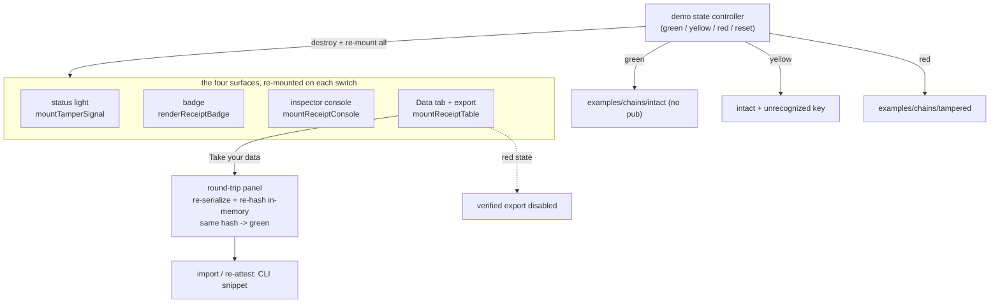

# feat: Demo dashboard at demo.html

## Summary

Build a dedicated `demo.html` that mounts all four browser surfaces (status
light, badge, inspector console, Data tab with "Take your data") over the demo
chain, with a tamper toggle that re-mounts them green↔red together and a live
in-browser export round-trip. Promote it in the nav, demote the homepage `#demo`
to a teaser linking to it, and repoint the explore card. Fully client-side with a
Reset button, reusing the existing mount functions and the homepage switcher
pattern — no new verification engine, no server, no build step.

---

## Problem Frame

The good demos are buried (see origin: `docs/brainstorms/2026-06-14-demo-dashboard-requirements.md`).
Nav "live demo" only scrolls to the homepage `#demo` block, which shows a single
surface (the status light) on a mock dashboard. The badge, the verified Data tab,
the console, the export, and the format-agnostic round-trip live behind one card
in the explore grid (`badge/light.html` et al.), so the product looks smaller than
it is and the portability round-trip — which is hard to grasp from prose — is never
watched. A single dashboard page with everything on, promoted in the nav, fixes
both.

---

## Requirements

Carried from origin. Grouped by concern; R-IDs match the origin doc.

**Page and navigation**

- R1. `demo.html` mounts all four surfaces (status light, badge, Data tab with the
  "Take your data" export control, inspector console) over the demo chain.
- R2. The nav promotes `demo.html` as a first-class item; "live demo" links to it
  rather than scrolling to the homepage block.
- R3. The homepage `#demo` section becomes a teaser (a live light plus a clear CTA
  to `demo.html`).
- R4. The "Every piece, working" explore card points to `demo.html`; the four
  `badge/*.html` pages remain reachable as deep-links.

**Tamper toggle and surfaces**

- R5. A tamper toggle flips the whole dashboard between verified and tampered
  states (green↔red, plus the gap/yellow state), driving every surface at once.
- R6. The toggle swaps the pre-baked committed chains (`examples/chains`
  intact/tampered/gap); it does not free-edit data.

**Export round-trip**

- R7. The Data tab's "Take your data" export works live (verified bundle or
  rows-only), as it does anywhere the Data tab mounts.
- R8. A round-trip panel re-verifies the exported data as a different format in the
  browser (Web Crypto), showing the matching Semantic hash and a green light, with
  no server.
- R9. The import / re-attest half is shown as a copy-pasteable CLI snippet, not a
  live browser action.
- R10. In the tampered (red) state, the verified-bundle export is disabled and the
  page makes clear you cannot export a verified bundle of tampered data.

**State and reset**

- R11. The demo is fully client-side and per-visitor: no server, database, or
  shared state.
- R12. A "Reset demo" button restores the pristine verified state and clears the
  round-trip panel; a reload does the same.

**Copy**

- R13. All demo copy obeys `docs/MESSAGING.md` (continuity not correctness, the
  "really running in your browser, not a mockup" framing, no banned words).

---

## Key Technical Decisions

- **Generalize the homepage switcher with a per-surface state config.** The homepage
  re-mounts the status light by calling `mountTamperSignal` with a different
  `chain`+`pub` (see `index.html` `STATES`). The demo controller extends that to all
  four surfaces, but the four mounts take different arguments — the light and badge
  take a public-key hex, the Data tab takes a `tableUrl`, the console takes neither —
  so the `STATES` map carries a per-surface config, not a single `{chain, pub}`.
  Lifecycle also differs: `mountTamperSignal`, `mountReceiptConsole`, and
  `mountReceiptTable` return a handle with `destroy()`; `renderReceiptBadge` returns
  nothing and clears its own container, so the controller **re-calls** the badge
  rather than destroying it. The controller destroys-then-re-mounts the three that
  have handles and re-renders the badge.

- **Reuse the existing state trick; no new fixtures.** Green = intact chain, no
  `pub`. Yellow = intact chain + an unrecognized key (the existing `"ab".repeat(32)`
  trick → unrecognized-key caveat), matching the homepage. Red = the committed
  tampered chain (the Data tab is pointed at `table-tampered.json` so it renders the
  "not the attested data" state, as `badge/table.html` already does). The toggle
  selects among `examples/chains/{intact,tampered}`; the gap/yellow fixture is not
  needed because the key trick produces yellow.

- **The round-trip re-parses, it does not re-hash the export bytes.** The attested
  hash is `sha256(canonicalize({headers, rows}))`, not a hash of the serialized CSV
  text — so the panel must take the attested canonical data, serialize it to a target
  format, **re-parse that format back into records**, re-canonicalize, hash with Web
  Crypto, and compare to the final receipt's output hash. That round trip (serialize
  → parse → canonicalize) is exactly what proves the format-agnostic claim; hashing
  the raw bytes would mismatch and show red. demo.html obtains the attested data by
  fetching the chain's `table.json` (the public file the Data tab already reads) and
  the final receipt's output hash from `chain.json` — not by reaching into the mounted
  table's private state, which exposes no accessor. It imports `canonicalize` from
  `badge/badge.js` (where it is exported) and a small SHA-256 helper; the
  serialize/parse step is demo-local (the private `serializeDoc` in `table.js` is not
  exported). The download is a separate convenience, not the thing being re-verified.

- **Export-disabled-in-red is inherited, not rebuilt.** The Data tab already offers
  the verified bundle only when green/yellow; the toggle simply lands the Data tab
  in the red/not-attested state, where its export control disables itself.

- **`demo.html` reuses the homepage shell as a static page.** Same nav, footer, and
  `index.html` CSS conventions; plain HTML + ES modules like the rest of the site.
  No bundler, no new dependency.

- **Verification is visual + reuse of already-tested logic.** The repo has no
  browser-DOM test harness (node tests are logic-only), so `demo.html` is verified
  by driving it and screenshotting (chrome-devtools / `ce-test-browser`) at
  execution time. The client-side logic underneath (canonicalize, serialize, the
  store-only zip, cross-format hashing) is already covered by the node and Python
  suites; this plan adds no automated UI tests and stands up no new framework.

---

## High-Level Technical Design

The state controller owns the single source of truth (current state); every surface
is a pure function of it, re-mounted on change. Reset is just a transition back to
green plus clearing the round-trip panel.

---

## Implementation Units

### U1. demo.html scaffold and layout

- **Goal:** A new static `demo.html` with the shared nav/footer/CSS shell and a
  responsive layout with slots for the four surfaces, the tamper toggle, the
  round-trip panel, and the Reset button.
- **Requirements:** R1, R13
- **Dependencies:** none
- **Files:** `demo.html`, `sitemap.xml`
- **Approach:** Mirror the `index.html` shell (top nav, footer, CSS variables).
  Layout (desktop): the toggle + Reset control group at the top, then the status
  light and badge in a two-up row (the verdict, prominent), then the Data tab full
  width, then the inspector console full width below; collapses to one column on
  narrow screens. The toggle reuses the `.switcher` three-button pattern; label the
  states **ALL GOOD / NEEDS A LOOK / TAMPERED** (matching the homepage) with a
  one-line caption under the toggle explaining the yellow case in plain words
  ("the chain verifies but the signing key isn't recognized — a human should look").
  Add the round-trip panel (pre-trigger: prompt copy + the always-visible CLI snippet)
  with a "Run the round-trip" button, and the Reset button in the top control group
  (scope: whole dashboard). All copy is MESSAGING-compliant ("really running in your
  browser, not a mockup"; continuity not correctness; no em dashes). Add `demo.html`
  to `sitemap.xml`.
- **Patterns to follow:** `index.html` `.top` nav / footer / `.switcher` markup;
  `docs/MESSAGING.md` copy rules.
- **Test scenarios:** `Test expectation: none -- static scaffold; verified by
  screenshot once surfaces mount in U2.`
- **Verification:** the page loads with the shell, empty surface slots, toggle, and
  Reset present; nav/footer match the site.

### U2. Mount the four surfaces over the demo chain

- **Goal:** Mount the status light, badge, console, and Data tab (with export) over
  the intact demo chain on load.
- **Requirements:** R1, R7
- **Dependencies:** U1
- **Files:** `demo.html` (module script)
- **Approach:** Import and call `mountTamperSignal` (light), `renderReceiptBadge`
  (badge), `mountReceiptConsole` (console), and `mountReceiptTable` (Data tab) from
  `badge/*.js`, each pointed at `examples/chains/intact/chain.json`. The Data tab's
  "Take your data" control comes for free (shipped in `mountReceiptTable`).
- **Patterns to follow:** the mount calls in `badge/light.html`, `badge/badge.html`,
  `badge/console.html`, `badge/table.html`; the `index.html` demo mount.
- **Test scenarios:**
  - Happy path: all four surfaces render green over the intact chain. Covers AE1
    (green half).
  - Edge: the Data tab shows the "Take your data" control in the green state.
- **Verification:** screenshot shows light, badge, console, and verified Data tab
  all green; the export control is present.

### U3. Demo state controller: tamper toggle and Reset

- **Goal:** A controller that switches the whole dashboard between green / yellow /
  red by destroying and re-mounting all four surfaces over the selected chain, and a
  Reset that returns to green and clears the round-trip panel.
- **Requirements:** R5, R6, R10, R11, R12
- **Dependencies:** U2
- **Files:** `demo.html` (module script)
- **Approach:** Generalize the `index.html` `STATES`/`setState` pattern. `STATES` is a
  per-surface config (green = intact/no pub; yellow = intact + unrecognized key; red =
  tampered chain with the Data tab pointed at `table-tampered.json`), because the four
  mounts take different arguments (light/badge take a pub hex, the Data tab takes a
  `tableUrl`, the console takes neither). `setState(name)` destroys the three handle
  surfaces (`mountTamperSignal`, `mountReceiptConsole`, `mountReceiptTable`) and
  re-mounts them, and re-calls `renderReceiptBadge` (which has no `destroy()` — it
  clears its own container). Reset calls `setState("green")` and clears the round-trip
  panel. No data is edited; only the pre-baked state selection changes. The toggle and
  Reset are co-located in one control group; Reset's scope is the whole dashboard.
- **Patterns to follow:** `index.html` `STATES` + `setState` (the re-mount and
  `aria-pressed` handling); the per-surface mount-argument shapes in `badge/*.html`.
- **Test scenarios:**
  - Happy path: toggling to red re-mounts all four surfaces into the broken state at
    once; toggling back to green restores them. Covers AE1.
  - Edge: in the red state the Data tab's verified-bundle export is disabled (no new
    logic — inherited from the Data tab). Covers AE3.
  - Edge: Reset from any state returns all surfaces to green and clears the
    round-trip panel. Covers AE4.
- **Verification:** screenshots of green→red→reset show every surface tracking the
  state together; export disabled in red.

### U4. Live export round-trip panel

- **Goal:** A panel with a dedicated "Run the round-trip" button that, from the green
  state, re-verifies the attested data across a format change live in the browser
  (matching hash, green), with a CLI snippet for the import/re-attest half.
- **Requirements:** R8, R9
- **Dependencies:** U2
- **Files:** `demo.html` (module script)
- **Approach:** A **dedicated "Run the round-trip" button** triggers the panel
  (distinct from the Data tab's "Take your data" download, so it works even if the
  visitor never downloads, and never implies a browser import). On click, demo.html
  fetches the chain's `table.json` (the attested canonical data), serializes it to a
  target format (e.g. CSV), **re-parses that format back into records**,
  re-canonicalizes with `canonicalize` (imported from `badge/badge.js`), hashes with
  Web Crypto, and compares to the final receipt's output hash read from `chain.json`.
  The panel shows: an "Exported as CSV, re-verified as JSON" caption, the attested
  hash and the re-verified hash side by side (short form), a green status dot, and a
  copy-pasteable CLI snippet (`receipts ingest <file> --as period`) for the
  bring-it-back leg. Before the button is pressed, the panel shows prompt copy plus
  the CLI snippet (the snippet is always visible). In-memory re-verification; the
  download is a convenience. (Re-parse, not raw-byte hashing — the attested hash is
  over the canonical document, not the serialized text.)
- **Patterns to follow:** `badge/table.js` for how the canonical doc is hashed
  (`canonicalize` from `badge/badge.js` + SHA-256); the cross-format identical-hash
  guarantee in `tests/test_portability_integrity.py`.
- **Test scenarios:**
  - Happy path: running the round-trip shows the attested data serialized to CSV,
    re-parsed and re-verified as JSON, with a matching Semantic hash and green light.
    Covers AE2.
  - Edge: the round-trip is actionable only in green/yellow (the attested states);
    the CLI snippet is always shown, including in the panel's pre-trigger state.
  - Integration: the re-parse → re-canonicalize → hash path equals the attested hash,
    the same cross-format guarantee covered by `tests/test_portability_integrity.py`.
- **Verification:** screenshot shows the round-trip panel with the caption, matching
  hashes, a green dot, and the CLI snippet; the empty panel shows the prompt + snippet.

### U5. Nav promotion, homepage teaser, and explore card

- **Goal:** Promote `demo.html` in the nav, demote the homepage `#demo` to a teaser
  linking to it, and repoint the "Every piece, working" explore card.
- **Requirements:** R2, R3, R4
- **Dependencies:** U1
- **Files:** `index.html`
- **Approach:** Point the nav "live demo" entry at `demo.html`. Shrink the `#demo`
  section to a teaser: a single live status light (green, over the intact chain) plus
  a prominent "See the full demo →" CTA to `demo.html`. Drop the green/yellow/red
  switcher from the homepage — the interactive states now live on `demo.html`, and a
  single live light keeps the teaser from competing with the full demo. Repoint the
  explore "Every piece, working" card to `demo.html`. Leave the four `badge/*.html`
  pages in place as deep-links.
- **Patterns to follow:** `index.html` nav (~line 411), `#demo` section (~line 521),
  `#explore` card grid (~line 619).
- **Test scenarios:** `Test expectation: none -- markup/nav changes; verified by
  screenshot and link-resolution.`
- **Verification:** nav and the explore card open `demo.html`; the homepage `#demo`
  reads as a teaser with a working CTA; `badge/*.html` still load.

---

## Acceptance Examples

Carried from origin.

- AE1. Toggle drives every surface. **Covers R5, R6.** Given green, when the visitor
  toggles to tampered, then the light, badge, Data tab, and console all show the
  broken state at once; toggling back returns them all to green.
- AE2. Live round-trip stays green. **Covers R8.** Given green, when the visitor runs
  the round-trip, then the same data re-verifies as a different format with a matching
  hash and a green light.
- AE3. No verified export of tampered data. **Covers R10.** Given tampered, when the
  visitor looks at the export control, then the verified-bundle option is disabled
  with a clear reason (rows-only may still download, marked unverified).
- AE4. Reset restores pristine state. **Covers R12.** Given the visitor has toggled
  and/or run the round-trip, when they click Reset, then the dashboard returns to the
  pristine green state with the round-trip panel cleared.

---

## Scope Boundaries

**Deferred for later** (origin)

- Free-form cell editing to craft arbitrary tampered states (the pre-baked toggle is
  v1).
- Retiring the individual `badge/*.html` pages (kept as deep-links for now).

**Outside this product's identity** (origin)

- A shared or social sandbox, or any server-backed demo state (and the hourly reset
  it would require) — it contradicts the no-server stance the demo exists to prove.
- Browser-native import / re-attest — signing needs the private key; the return leg
  is a CLI snippet.

**Deferred to follow-up work** (plan-local)

- A bespoke `demo.html` social/OG thumbnail image.

---

## Risks & Dependencies

- **No browser-DOM test harness.** The page's interactivity is verified visually
  (screenshot/interaction via chrome-devtools / `ce-test-browser`), not by automated
  CI. Mitigation: keep new logic thin and reuse the already-tested client-side path;
  the round-trip's correctness rests on the canonicalization the node/Python suites
  already cover.
- **Surface lifecycle is not uniform.** `mountTamperSignal`, `mountReceiptConsole`,
  and `mountReceiptTable` return a `destroy()` handle; `renderReceiptBadge` returns
  nothing and clears its own container. The controller must destroy-and-re-mount the
  first three and re-call the badge — a single "destroy every handle" loop would throw
  on the badge. Handled in U3.
- **Relative asset paths.** `demo.html` sits at the repo root like `index.html`, so
  `badge/*.js` and `examples/chains/*` resolve with the same relative paths the
  homepage uses; verify on the served site, not just `file://`.

---

## Documentation / Operational Notes

- Add `demo.html` to `sitemap.xml` (U1). No CHANGELOG entry needed — this is a site
  page, not a library release. Optionally link the new demo from the
  data-portability blog post once live.

---

## Sources / Research

- `index.html` — the `STATES`/`setState` switcher and `mountTamperSignal` mount
  (~line 699), the `#demo` section (~line 521), the `#explore` card grid (~line 619),
  the nav (~line 411).
- `badge/light.html`, `badge/badge.html`, `badge/console.html`, `badge/table.html` —
  the mount calls for `mountTamperSignal`, `renderReceiptBadge`, `mountReceiptConsole`,
  `mountReceiptTable`.
- `badge/table.js` — `mountReceiptTable`, the "Take your data" export control, and the
  `serializeDoc`/`canonicalize`/`sha256Hex` helpers the round-trip reuses.
- `examples/chains/{intact,tampered,gap}` — the committed demo fixtures the toggle
  swaps between.
- `docs/MESSAGING.md` — copy rules.
