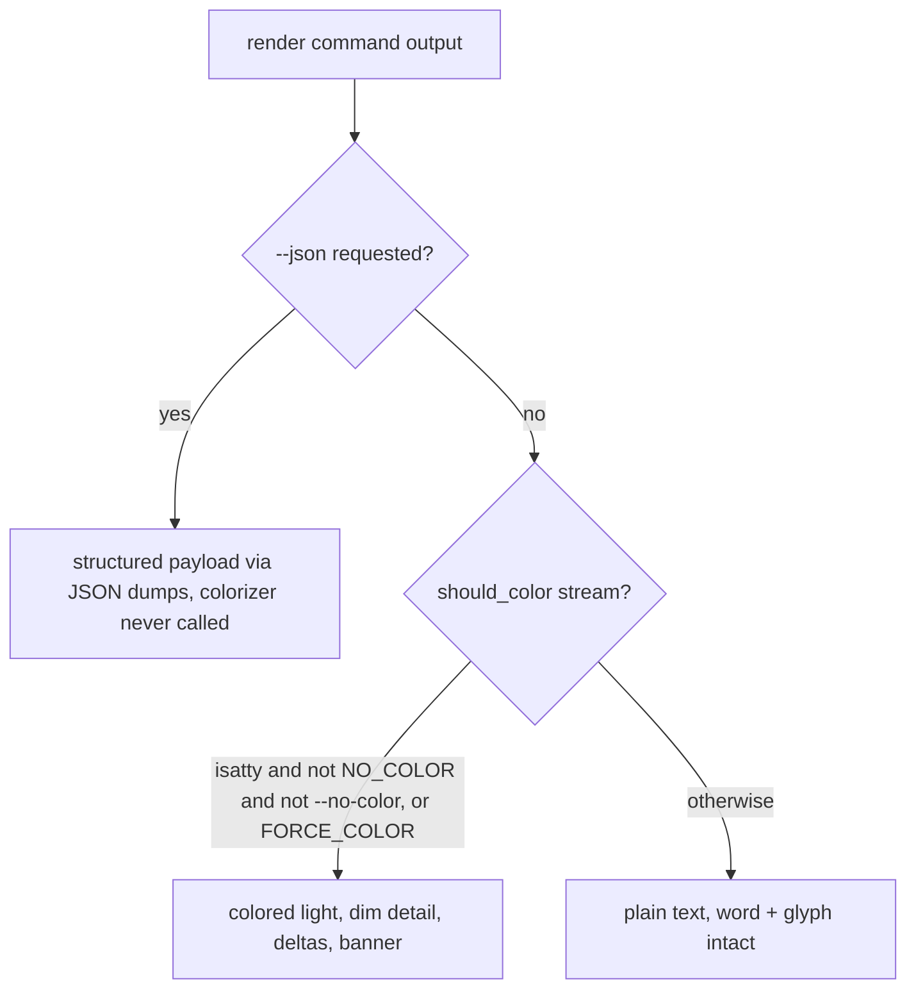

# feat: Finish the CLI `--json` surface and add a colorful human-facing terminal

## Summary

Complete the CLI's machine face by adding `--json` to `ingest`, `export`, and
`doctor` (and `band`/`settle_hours` to `log --json`), and add a human face: a
colored `●` traffic-light verdict, dimmed hashes, aligned columns, colored
`diff`/totals deltas, and a first-run banner. Color is gated to an interactive
terminal and never appears under `--json` or in piped output. Both the Python
(`receipts`) and node (`tamper-signal`) CLIs ship together with identical palette,
gating, and JSON shapes — except `doctor --json`, which is Python-only because node
has no `doctor` command.

## Problem Frame

The CLI is the first surface every human touches and the contract every agent
scripts against, and neither face is finished. On the machine side, `verify`,
`diff`, `log`, and `anchor` emit `--json`, but the three commands that report what
just happened — `ingest`, `export`, `doctor` — do not, so an agent has to scrape
text. On the human side there is no color at all: the verdict the whole product is
built around renders as plain words and a `✓`/`✗` glyph, with hashes and totals in
one undifferentiated tone. The product owns the traffic-light metaphor; the terminal
just never shows it. The constraint is that this is a trust tool, so color must
amplify the verdict and must never corrupt the machine output the other half of this
work is perfecting.

---

## Requirements

Traced from the origin requirements doc (see origin:
`docs/brainstorms/2026-06-23-cli-json-and-color-requirements.md`).

**Machine face: the `--json` surface**

R1. `ingest` and `export` gain `--json` in both CLIs; `doctor` gains `--json` in
Python only (node has no `doctor` command). Each prints one structured object to
stdout. `verify`/`diff`/`log`/`anchor` are unchanged. (Origin R1, adjusted per the
node-`doctor` discovery — see KTD: doctor parity.)

R2. Each new payload mirrors the command's human output as structured fields:
`ingest` carries source filename, evidence and semantic hashes, row/column counts,
and tolerance when declared; `export` carries output path, row/column counts, data
hash, and whether a bundle was written; `doctor` carries the per-check
name/pass/fix list, the warnings list, and an overall pass flag. (Origin R2.)

R3. `log --json` additionally surfaces declared `band` and `settle_hours` from the
source manifest when a tolerance declaration is present, in both stacks. (Origin R3.)

R4. New payloads follow the established convention: a pretty-printed object on
stdout, failures rendered as a structured error object, and all human notices routed
to stderr so stdout stays a clean payload. (Origin R4.)

R5. For each shared command, the Python and node `--json` payloads are
shape-identical (same keys). (Origin R5.)

**Human face: color and presentation**

R6. The verdict renders as a colored `●` light (green / amber / red) that always
agrees with the exit code (0 / 2 / 1) and the verdict word. (Origin R6.)

R7. Hashes and secondary detail are dimmed and label columns align, so everyday
output scans at a glance. (Origin R7.)

R8. `diff` and totals deltas color the direction of movement (decrease vs increase
visually distinct). (Origin R8.)

R9. `init` and `demo` show a restrained first-run banner. No command uses spinners,
emoji, animation, or celebratory copy; a red verdict carries no ornament. (Origin
R9.)

R10. Color applies to verdict-bearing commands and as light accents elsewhere, and
is always redundant with text — never the sole carrier of meaning. (Origin R10.)

**Gating and control**

R11. ANSI escapes are emitted only when stdout is an interactive terminal; piped,
redirected, and non-TTY output is plain text, the banner included. (Origin R11.)

R12. `--json` output is never colored, on any stream, regardless of TTY state.
(Origin R12.)

R13. `NO_COLOR` forces color off, `FORCE_COLOR` forces it on past the TTY check, and
a `--no-color` flag is available. No `--color=when` tri-state. (Origin R13.)

R14. Color is a small self-contained ANSI helper in each stack with no new runtime
dependency; the two helpers share one palette and one gating rule. (Origin R14.)

**Cross-stack and testing**

R15. The `--json` surface and the color treatment ship in both CLIs together, with
identical palette, gating, and JSON shapes (modulo `doctor`). (Origin R15.)

R16. A regression test in each stack asserts no ANSI escape sequence appears in
`--json` output or in non-TTY/piped output. This is the acceptance gate. (Origin
R16.)

R17. The new `--json` payload shapes are pinned by tests in both stacks. (Origin
R17.)

---

## Key Technical Decisions

- **Color lives only in the presentation layer.** The colorizer is called from
  `tamper_signal/cli.py` and `node/cli.js`, never from the library
  (`receipts.py` / library modules). `verify`'s verdict lines are produced plain by
  `verify_chain` in `tamper_signal/receipts.py`; `cmd_verify` colorizes the leading
  glyph at print time based on `result.verdict`. This keeps library output
  deterministic and leaves `--json` (which reads `result.verdict`, not colored
  lines) untouched.

- **One gating chokepoint, with defense in depth.** A single `should_color(stream)`
  predicate is the only thing that decides color: it returns false when stdout is not
  a TTY, when `NO_COLOR` is set, or when `--no-color` was passed; it returns true when
  `FORCE_COLOR` is set, overriding the TTY check. When both `NO_COLOR` and
  `FORCE_COLOR` are set, `NO_COLOR` wins (the no-color.org convention), in both stacks.
  `should_color` is only ever evaluated against stdout; stderr (where notices go) is
  always plain text regardless of TTY state or `FORCE_COLOR`. Independently, `--json`
  branches never call the colorizer at all. Two unrelated reasons keep JSON clean, so a
  regression in one does not leak ANSI.

- **doctor parity is Python-only.** Node has no `doctor` command (AGENTS.md documents
  it as Python-only; node's command table is `keygen, ingest, verify, diff, log,
  export`). `doctor --json` lands in Python; porting `doctor` to node is out of scope
  for 1.7.1. All other surfaces stay at two-stack parity.

- **No new dependency.** Color is hand-rolled SGR escape codes in a new module per
  stack (`tamper_signal/color.py`, `node/color.js`), preserving the lean footprint
  (Python: `openpyxl` + `cryptography`; node: zero runtime deps). These modules sit
  outside the `badge/*.js` → `tamper_signal/static/*.js` sync axis, so no static-asset
  copy is involved.

- **Palette parity by shared definition.** Both helpers define the same semantic
  palette (green / amber / red / dim / bold) using identical SGR codes, pinned by a
  small cross-stack expectation so the two terminals read as one product.

- **Verdict label and delta direction are fixed, not the implementer's choice.** The
  library returns `result.verdict` as `green` / `yellow` / `red` (the keys of the
  existing exit-code map); the light keys on that value and the printed word is the
  uppercased verdict (`GREEN` / `YELLOW` / `RED`). "Amber" names the color; the word
  stays `YELLOW` to match the verdict value and the existing "the light is yellow"
  copy. Deltas color direction as a neutral cue, not a value judgment (the product
  proves continuity, not correctness): increase → green, decrease → red, and the signed
  value (`+12` / `-5`) is always printed so direction survives `NO_COLOR` and reads for
  colorblind users.

- **Label alignment and the banner are fixed templates.** Labels align by padding to
  the longest label within each command's output block, using the same algorithm in
  both stacks. The `init`/`demo` banner is a bounded fixed template (product name + a
  one-line tagline + version), byte-identical text across stacks, gated like all color
  so non-TTY/piped output omits it.

- **The no-leak test must force the gate ON.** Per institutional learnings
  (`docs/solutions/logic-errors/numeric-text-canonicalization-cross-format-hash-mismatch.md`,
  `.../sigstore-federated-oidc-issuer-certificate-mismatch.md`), a test that asserts
  clean JSON while color is gated off anyway is a fixed-point fixture that passes
  whether or not the gate works. The regression test exercises the colored path
  (Python: monkeypatch `isatty`/set `FORCE_COLOR` with `capsys`; node: `execFileSync`
  with `FORCE_COLOR=1`) and asserts zero `\x1b` bytes under `--json`, and asserts
  plain text under a non-TTY pipe with no `FORCE_COLOR`.

---

## High-Level Technical Design

The rendering decision for any command's stdout:

`should_color` is the single gate (KTD: one gating chokepoint). The `--json` arm is
a separate branch that bypasses the colorizer entirely, so JSON cleanliness does not
depend on the gate alone.

---

## Implementation Units

### U1. Python color/render helper

**Goal:** A self-contained ANSI helper that owns the palette and the gating rule for
the Python CLI.

**Requirements:** R6, R7, R11, R13, R14.

**Dependencies:** none.

**Files:** create `tamper_signal/color.py`; create `tests/test_color.py`.

**Approach:** Expose a `should_color(stream)` predicate (isatty + `NO_COLOR` +
`FORCE_COLOR` + a process-level `--no-color` flag the CLI sets) and small primitives
— `light(verdict)` → colored `●`, `dim(text)`, `bold(text)`, `delta(value)` for
signed movement — each a no-op returning plain text when `should_color` is false.
Hand-rolled SGR codes; no dependency. `FORCE_COLOR` overrides the isatty check;
`NO_COLOR` and `--no-color` always win.

**Patterns to follow:** module shape of `tamper_signal/canonical.py` /
`tamper_signal/keys.py` (small focused module imported via `from .color import ...`).

**Test scenarios:**
- `should_color` true when stream isatty and no env overrides; false when not a TTY.
- `NO_COLOR` set → false even when isatty; `--no-color` flag → false even when isatty.
- `FORCE_COLOR` set → true even when stream is not a TTY.
- `light("green"/"yellow"/"red")` emits the green/amber/red `●` with the matching
  word/glyph present when color on; returns plain text when color off.
- `delta` colors a negative value and a positive value distinctly when color on;
  plain when off.

**Verification:** `tests/test_color.py` passes; the gating matrix is covered.

### U2. Node color/render helper

**Goal:** The node mirror of U1 with identical palette and gating.

**Requirements:** R6, R7, R11, R13, R14, R15.

**Dependencies:** none for authoring — the palette SGR codes and gate semantics are
fixed in this plan (see KTDs), so U2 can proceed in parallel with U1. Node never
imports Python; the U2 cross-stack test asserts parity rather than depending on U1.

**Files:** create `node/color.js`; create `node/test/color.test.js`; register the new
test file in `package.json` `scripts.test` (the list is not globbed).

**Approach:** Mirror U1's `shouldColor(stream)` and primitives as an ESM module
(`node/color.js`), using `process.stdout.isTTY`, `process.env.NO_COLOR`,
`process.env.FORCE_COLOR`, and the `--no-color` flag. Same SGR codes as U1.

**Patterns to follow:** `node/canonical.js` / `node/keys.js` ESM module shape; the
manual test-file registration in `package.json` `scripts.test`.

**Test scenarios:**
- Mirror every U1 scenario (TTY gate, `NO_COLOR`, `FORCE_COLOR`, `--no-color`, light,
  delta).
- Palette parity: the SGR codes emitted for green/amber/red/dim match U1's exactly
  (pins R15).

**Verification:** `node --test` runs `node/test/color.test.js`; gating matrix and
palette parity pass.

### U3. Python `--json` surface

**Goal:** `ingest`, `export`, and `doctor` emit `--json`; `log --json` gains
`band`/`settle_hours`.

**Requirements:** R1, R2, R3, R4, R17.

**Dependencies:** none.

**Files:** modify `tamper_signal/cli.py` (`cmd_ingest` ~216, `cmd_export` ~756,
`cmd_doctor` ~583, `cmd_log` ~1288, and the argparse declarations in `build_parser`
~1492-1704); modify `tests/test_cli_agent_ergonomics.py` and `tests/test_log.py`.

**Approach:** Add `--json` (`action="store_true"`) to the three parsers. In each
command's `--json` branch, assemble the documented fields and
`print(_json.dumps(payload, indent=2))`, following the local-`import json as _json`
convention. Use the `{"ok": false, "error": ...}` failure shape on error paths.
`doctor` serializes its existing `checks` (name/ok/fix tuples) + `warns` + an overall
pass flag. `log --json` attaches `band`/`settle_hours` per run entry inside each
`runs[]` object, sourced from that snapshot's `tolerance` dict
(`tamper_signal/history.py` ~180), present only when that snapshot declares tolerance
and omitted otherwise so a mixed-history log stays valid and both stacks agree.
Notices stay on stderr.

**Patterns to follow:** `cmd_verify --json` (`tamper_signal/cli.py` ~462-485) and
`cmd_anchor` failure-object shape (~1401-1408).

**Test scenarios:**
- Covers R2. `ingest --json` returns an object with source filename, evidence and
  semantic hashes, row and column counts; tolerance present only when declared.
- Covers R2. `export --json` returns output path, row/column counts, data hash, and a
  bundle flag that is true after `--bundle` and false otherwise.
- Covers R2. `doctor --json` returns the per-check name/ok/fix list, warnings, and an
  overall pass flag; the pass flag is false when a check fails.
- Covers R3. `log --json` includes `band` and `settle_hours` per run entry when that
  snapshot declares tolerance, and omits them on entries that do not (a mixed-history
  log stays valid).
- Covers R4. A failing `ingest`/`export` under `--json` prints the structured error
  object on stdout, not a bare line; the human error stays on stderr.

**Verification:** the new `--json` assertions pass via `main([...])` + `capsys`.

### U4. Node `--json` surface

**Goal:** node `ingest` and `export` emit `--json`; node `log --json` gains
`band`/`settle_hours`. (No `doctor` in node.)

**Requirements:** R1, R2, R3, R4, R5, R17.

**Dependencies:** U3 (match payload key shapes for R5).

**Files:** modify `node/cli.js` (`cmdIngest` ~245, `cmdExport` ~1040, `cmdLog` ~965,
and their `parseArgs` option blocks); add/modify a node test (e.g.
`node/test/ingest.test.js` / extend `node/test/log.test.js`) and register any new file
in `package.json` `scripts.test`.

**Approach:** Add `json: { type: "boolean", default: false }` to the `parseArgs`
options for `cmdIngest`/`cmdExport`; emit `console.log(JSON.stringify(payload, null,
2))` with the same keys U3 produced. Extend node `log --json` with band/settle from
the snapshot tolerance. Notices stay on stderr (`console.error`).

**Patterns to follow:** `cmdVerify` `--json` block (`node/cli.js` ~403-423, "same
payload shape as the Python CLI").

**Test scenarios:**
- Covers R5. `ingest --json` and `export --json` produce the same top-level keys as
  the Python payloads for the same inputs (cross-stack shape parity).
- Covers R3. node `log --json` includes `band`/`settle_hours` when tolerance is
  declared.
- Covers R4. failure under `--json` prints the structured error object on stdout.

**Verification:** `node --test` CLI assertions pass via the `execFileSync` `runCli`
pattern.

### U5. Python human-face color application

**Goal:** Apply the helper across Python human output without touching `--json` or
library code.

**Requirements:** R6, R7, R8, R9, R10, R11, R12, R13.

**Dependencies:** U1, U3 (U3 must land first so the `--json` branches exist in
`cmd_ingest`/`cmd_export`/`cmd_doctor` before U5 colorizes the human branches in the
same handlers; U5 must not color the `--json` branches).

**Files:** modify `tamper_signal/cli.py` (`cmd_verify` ~388/508, `cmd_ingest`,
`cmd_export`, `cmd_doctor`, `cmd_diff`, `cmd_log`, and `cmd_init`/`cmd_demo` for the
banner); wire `--no-color` via a shared `add_help=False` parent parser passed to every
subparser (`parents=[...]`) in `build_parser`; add CLI color-rendering tests to a new
`tests/test_cli_color.py` (helper unit tests stay in `tests/test_color.py` from U1).

**Approach:** At print time, colorize the leading verdict glyph for `verify` from
`result.verdict` (word = uppercased verdict, per KTD), dim hashes, align label columns
(pad to the longest label in each command's output block), and color `diff`/totals
deltas (increase green, decrease red, signed value always printed) via the U1
primitives. Add the fixed `init`/`demo` banner template (KTD). Every colorized print
goes through `should_color`, so non-TTY and `--no-color` degrade to today's plain
output. The `--json` branches from U3 never call the colorizer.

**Patterns to follow:** existing stdout print sites listed in research (`cmd_doctor`
glyphs ~688-693; `cmd_verify` `for line in result.lines: print(line)` ~508).

**Test scenarios:**
- Covers R6, AE1. With color forced on, `verify` on a green chain emits a green `●`
  and the word GREEN; the exit code is 0.
- Covers R9, AE4. With color forced on, a red verdict emits a red `●` and the word
  RED with no emoji or celebratory text.
- Covers R11, AE1. Piped (non-TTY) `verify` output contains no `\x1b` and still shows
  the word and glyph.
- Covers R13, AE3. `NO_COLOR` set → plain text in a TTY; `--no-color` → plain text.
- Covers R8. `diff` with a decreased and an increased total colors the two
  directions distinctly when color is on.

**Verification:** color-on and color-off snapshots differ only by ANSI; word+glyph
present in both.

### U6. Node human-face color application

**Goal:** The node mirror of U5 (no `doctor`).

**Requirements:** R6, R7, R8, R9, R10, R11, R12, R13, R15.

**Dependencies:** U2; coexists with U4.

**Files:** modify `node/cli.js` (`cmdVerify` ~425, `cmdIngest`, `cmdExport`,
`cmdDiff`, `cmdLog`, and `init`/`demo` equivalents if present); wire `--no-color` by
adding `"no-color": { type: "boolean", default: false }` to every command's
`parseArgs` options block; add a node color-rendering test.

**Approach:** Mirror U5 through `node/color.js`, colorizing the verdict glyph from
`result.verdict` at the `for (const line of result.lines) console.log(line)` site and
dimming/aligning/deltaing the other commands. `--json` branches from U4 never call the
colorizer.

**Patterns to follow:** U5; node verdict print site (`node/cli.js` ~425).

**Test scenarios:**
- Mirror U5's verify-green, verify-red, piped-plain, `NO_COLOR`/`--no-color`, and diff
  delta scenarios via `execFileSync` with `FORCE_COLOR=1` for the color-on cases.
- Covers R15. node and Python emit the same SGR codes for the verdict light on
  equivalent inputs.

**Verification:** `node --test` color cases pass; parity with U5 holds.

### U7. Acceptance-gate regression test, cross-stack parity, and docs

**Goal:** Make the no-ANSI-leak rule an explicit gate, pin cross-stack parity, and
update docs.

**Requirements:** R5, R12, R15, R16, R17.

**Dependencies:** U3, U4, U5, U6.

**Files:** add the gate test to each stack (`tests/test_cli_color.py` and a
`node/test/` file, registered in `package.json`); modify `AGENTS.md` (document
`--json` on `ingest`/`export`/`doctor[py-only]` and the color/`NO_COLOR` behavior);
modify `CHANGELOG.md` (1.7.1 entry).

**Approach:** For every command in each stack, with color forced on, assert `--json`
stdout contains zero `\x1b` bytes; and with output piped and no `FORCE_COLOR`, assert
stdout is plain. Add a cross-stack assertion that shared commands emit identical
`--json` keys (R5). Document the surface and the gating contract.

**Execution note:** Write the gate test first and confirm it fails against a
deliberately color-leaking stub before the real implementation passes it — the test
must be able to fail on the bug it guards (see KTD: the no-leak test must force the
gate ON).

**Test scenarios:**
- Covers R12, R16. Every command with `--json` under `FORCE_COLOR=1`: stdout parses as
  JSON and contains no `\x1b`.
- Covers R16. Every command piped (non-TTY, no `FORCE_COLOR`): stdout has no `\x1b`.
- Covers R13. With both `NO_COLOR` and `FORCE_COLOR` set, color is off in both stacks
  (NO_COLOR wins).
- Covers R5, R15. `ingest`/`export`/`log` `--json` keys match between Python and node.
- Covers R15. The first-run banner text and the verdict-word/`●` palette match between
  Python and node.

**Verification:** the gate test is present and passing in both stacks; AGENTS.md and
CHANGELOG reflect the new surface.

---

## Scope Boundaries

**Outside this product's identity (carried from origin)**

- Emoji or celebratory verdict copy, and anything that softens a red verdict.

**Deferred for later (carried from origin)**

- A full TUI or interactive mode, and animated progress / spinners.
- A `--color=always|auto|never` tri-state and per-theme palettes.

**Deferred to follow-up work**

- Porting the `doctor` command to the node CLI (prerequisite for node `doctor
  --json`). Out of scope for 1.7.1.

---

## Acceptance Examples

AE1. **Covers R6, R11.** Given a green chain, when `receipts verify chain.json` runs
in a terminal, stdout shows a green `●` with the word GREEN; piped, it shows the word
and glyph with no ANSI.

AE2. **Covers R12, R16.** When any command runs with `--json`, or with stdout piped,
the captured bytes contain no ANSI escape sequence.

AE3. **Covers R13.** With `NO_COLOR` set in a terminal, output is plain text with word
and glyph intact; with `FORCE_COLOR` set and output piped, color is emitted — except
under `--json`, which stays clean.

AE4. **Covers R9.** A red verdict shows a red `●`, the word RED, and the broken link,
with no emoji or celebratory text.

---

## Risks & Dependencies

- **Fixed-point test risk.** The no-leak gate is only meaningful if it exercises the
  colored path; a test that runs with color gated off passes vacuously. Mitigated by
  the U7 execution note and the KTD forcing the gate on.
- **Cross-stack palette drift.** Two hand-maintained helpers can diverge. Mitigated by
  the U2/U6 parity assertions on SGR codes (the same discipline the golden vectors
  apply to canonicalization).
- **`verify` line origin.** Verdict lines come from `tamper_signal/receipts.py`
  (`verify_chain`), not `cli.py`. Coloring must happen at the cli print boundary; do
  not move color into the library, or `--json` and library tests inherit ANSI.

---

## Sources / Research

- Origin requirements: `docs/brainstorms/2026-06-23-cli-json-and-color-requirements.md`.
- `--json` convention and per-command print sites: `tamper_signal/cli.py`
  (`cmd_verify` ~462-485, `cmd_anchor` failure shape ~1401-1408, `cmd_doctor` glyphs
  ~688-693, `build_parser` ~1492-1704); `node/cli.js` (`cmdVerify --json` ~403-423,
  command table ~1122).
- Stderr-clean-stdout discipline: `tamper_signal/cli.py:300`; `node/cli.js` ~427-429.
- Tolerance storage for `log` band/settle: `tamper_signal/history.py` ~180-185.
- Test patterns: Python `main([...])` + `capsys` (`tests/test_cli_agent_ergonomics.py`,
  `tests/test_log.py`); node `execFileSync` `runCli` (`node/test/diff.test.js`,
  `node/test/log.test.js`); inline-parity precedent (`node/test/zip.test.js`); manual
  test registration in `package.json` `scripts.test`.
- Learnings on false-green / fixed-point tests:
  `docs/solutions/logic-errors/numeric-text-canonicalization-cross-format-hash-mismatch.md`,
  `docs/solutions/logic-errors/sigstore-federated-oidc-issuer-certificate-mismatch.md`,
  `docs/solutions/logic-errors/browser-zip-writer-drift-no-parity-test.md`.
