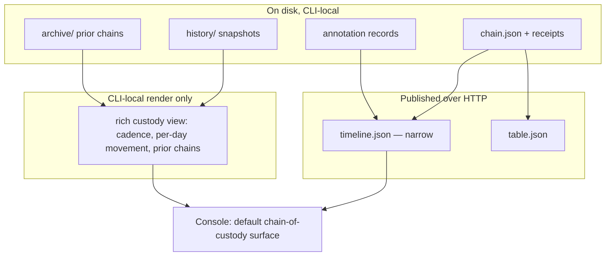
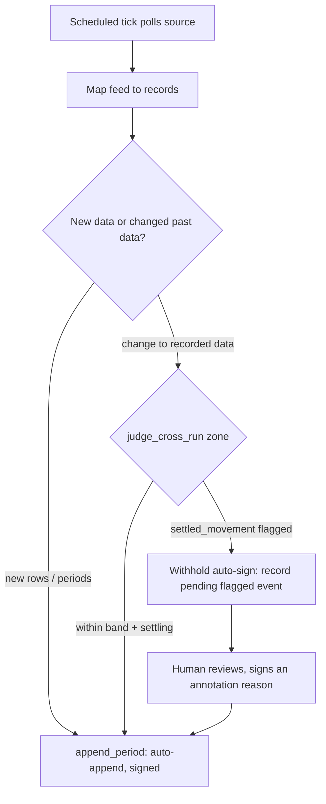

# feat: Tamper Signal v2.0 — end-to-end data provenance

## Summary

Build Tamper Signal v2.0: promote the console to the default chain-of-custody view, add signed change-reasons with self-declared authorship, make the verified table enforced (default-on plus opt-in strict mode), surface reuploads from existing run history, and add an embedded watcher that brings live API/JSON/RSS sources onto the same signed chain. Sequenced in two phases — the on-disk foundation first, the live-source watcher second — and shipped as one coordinated 2.0 (see origin: `docs/brainstorms/2026-06-25-v2-data-provenance-requirements.md`).

## Problem Frame

v1.x proves continuity at a point in time, but the surfaces are scattered and the history is invisible: the flagship is a small status light, the console is an opt-in debugging widget showing only the current chain, there is no record of *why* a value changed, and a live feed cannot be kept under custody without a manual re-ingest. The machinery to close this gap mostly exists — `append_period()` already continues a chain under a trusted signer, and the settled-movement judgment already detects retroactive changes to past dates — but it is wired for one-shot CLI use, not a default provenance experience or an unattended watcher. v2.0 assembles these primitives into the custody story and adds the two genuinely new pieces: a signed annotation record and a polling watcher.

---

## High-Level Technical Design

Two design facts shape everything below.

**1. The watcher is `append_period` plus a scheduler.** R12/R13 (auto-append new data; judge retroactive changes by band/settle) are already implemented in `tamper_signal/wrapper.py` (`append_period`) and `tamper_signal/history.py` (`judge_cross_run`, the two-zone settled/settling judgment). The net-new behavior is R14: when judgment would flag a `settled_movement`, the watcher must **withhold** auto-signing and pause for a human, rather than appending a yellow caveat the way an interactive re-ingest does.

**2. History and archive are deliberately unpublished.** `receipts serve` 404s everything under `history/` and `archive/` because run snapshots leak run cadence and per-day totals. The custody timeline (R2/R9/R10) wants exactly that data. Rather than break the privacy posture, v2.0 splits the surface: a **narrow, signed `timeline.json`** is published (the live chain plus a minimal reupload summary), while the **rich custody view** (run cadence, per-day movement, archived prior chains) renders **CLI-locally** and is never served. This preserves R15/R16 — a published green light never depends on, or leaks, CLI-local memory.

The live-source watcher routes every poll through the existing judgment, and the settled-zone branch is the only new gate:

---

## Requirements

Carried from origin (`docs/brainstorms/2026-06-25-v2-data-provenance-requirements.md`), grouped by capability.

**Provenance console as the chain-of-custody view**

- R1. The console becomes the default surface presented when Tamper Signal is added; the status light and badge remain available.
- R2. The console renders one timeline spanning the data's history: each import (with origin), change, and reupload.
- R3. Each timeline entry locates what changed (stage / period / columns) and by how much, reusing control-totals deltas.

**Signed mutation log and comments**

- R4. A change can carry a user-supplied reason and a self-declared author, both captured inside the signed chain; the author is signed attribution, not verified identity.
- R5. A signed comment is immutable; a correction is a new signed annotation that supersedes the prior one, both retained and visible.
- R6. The originating import records its source/origin in the custody log, extending today's `--origin`.

**Enforced verified data table**

- R7. The verified data table is a default, always-available view of the attested data; by default it never blocks other UI. An opt-in strict mode additionally gates other views on a broken chain.
- R8. The table continues to re-hash the served document in the viewer's browser and report VERIFIED / stale / broken.

**Reuploads and history**

- R9. Reuploads-as-updates appear in the timeline as continuations (period appends), recording who re-attested and when.
- R10. A viewer can inspect and independently re-verify any past period or state from the custody view.

**Live data sources (embedded watcher)**

- R11. Connect a live source (HTTP/JSON API, RSS, or comparable polled feed) and keep it on the same signed chain via a watcher running inside the host app, self-hosted, with no Tamper Signal cloud. Default shape is a stateless scheduled tick; an optional long-running daemon provides continuous polling.
- R12. New data from a live source is appended automatically by the watcher, attributed to the source/watcher identity.
- R13. A retroactive change to recorded data is judged by the declared tolerance: within band and settling window it folds in automatically; once settled, any movement pauses as a flagged event requiring a human signed reason.
- R14. The watcher holds a signing key to append unattended, but withholds auto-signing for settled-period changes; those wait for a human.

**Identity and positioning**

- R15. v2.0 preserves "your data and its proof never leave your app": the chain stays on disk and self-hosted; the watcher is a process the user runs.
- R16. A green light never depends on the watcher or console running; the on-disk chain stays the portable source of truth and verifies offline.

---

## Key Technical Decisions

- KTD1. **Signed annotations are a separate append-only record, not a new field on existing receipts.** Mirror the `run_snapshot` pattern in `tamper_signal/history.py` (own `kind`, content-addressed filename, `_sign_body`, body hash). This keeps existing source/transform receipt bodies byte-stable, and R5's supersede-never-overwrite maps onto append-only files carrying a `supersedes` pointer. Inline fields on the receipt body were considered but cannot express supersession without rewriting a signed receipt. Two integrity rules are load-bearing: (a) the annotation **binds to its target by the target's content hash** (a receipt hash, recorded *inside* `_sign_body` so the binding is signed and tamper-evident) — never a filename or mutable chain tail, which a later append would silently retarget; (b) **`supersedes` must reference an existing, verifying annotation in the same chain**; a dangling or non-verifying pointer is ignored (not rendered as a correction), and multiple annotations superseding the same target resolve newest-wins over verified records only.
- KTD2. **Published timeline stays narrow; rich history/archive stays CLI-local.** `history/` and `archive/` are 404'd by `serve` on purpose (they leak run cadence and per-day totals). The published `timeline.json` carries the live chain plus a minimal reupload summary; the rich custody view renders CLI-locally and is never served. Preserves R15/R16 and the existing privacy posture. (Surfaced for redirect: a richer publishable export is possible but would expose CLI-local memory — held as deferred.) **Honesty consequence:** this narrows what a remote (non-CLI) viewer/auditor receives versus R2's "whole history" and R10's "re-verify any past period" — which are satisfied at the CLI (U7), not over HTTP. U3/U7 must state plainly which promises the published surface fulfills and which require CLI access, so the served custody view is a documented boundary, not an implied full view.
- KTD3. **Strict mode is an additive state emit from the table, default off.** `mountReceiptTable`'s `refresh()` already computes the authoritative verdict; strict mode adds an `opts`/attribute and an `onState` (or event) emit the host listens to in order to gate other views. Not a verification change; default off keeps R7's "never blocks other UI."
- KTD4. **The watcher reuses the judgment engine, but `append_period` must be decomposed into judge-then-commit.** Today `append_period` (`tamper_signal/wrapper.py`) ingests and signs the new period, overwrites `chain.json`, and only *then* runs `judge_cross_run` — it commits before it judges. The watcher cannot "inspect judgment before accepting the append" against that flow, so U9/U10 factor out a judge-before-commit entry point (or add an append-then-rollback path) rather than calling `append_period` as-is. The withhold signal is the typed **`settled_movement` record from the judgment `details`**, not the `breached` map — `breached` deliberately merges `band_breach` (which auto-folds within band) and `settled_movement` (which withholds), so gating on `breached` would wrongly pause in-band drift. A bucket with no prior observation is new data: it auto-appends and is never a `settled_movement`. Reuse the judgment engine and the `breached` baseline-advancement guard; do not reuse `append_period`'s commit ordering.
- KTD5. **Cross-stack and byte-sensitivity discipline is a first-class constraint, not an afterthought.** Any new signed field goes through `_sign_body` in both `tamper_signal/receipts.py` and `node/receipts.js`, stays string/int/bool/null (no floats; route any numeric-looking text through the existing decimal coercion), and gains a `node/test/interop.test.js` assertion. New browser logic added to `badge/*.js` is copied to `tamper_signal/static/*.js` (enforced by `tests/test_integrations.py`) and pinned with its own parity test where it duplicates `node/` logic. New committed chains (annotations, watcher snapshots) are tested through the real CLI verify path so the raw-byte `receipt_hashes` check runs (CRLF guard).
- KTD6. **Console-as-default is a presentation change in the attach helpers, not a verification change.** `tamper_signal/integrations.py` and the framework helpers surface the console page/route as primary and downgrade the light to optional.
- KTD7. **The watcher key is dedicated, isolated, and must be the chain's trusted signer.** Two constraints. *Trust:* `append_period` raises `UntrustedSignerError` unless the importer's key is the chain's signer or pre-registered via the trusted-pub mechanism — so a watcher provisioned with a fresh CI-style key fails closed on every tick. The watcher key must be the chain signer (or pre-trusted); this is a setup precondition with a failure test. *Isolation:* the watcher uses a **dedicated signing key, distinct from the interactive human key**, stored outside the working tree (env var / OS keychain / secrets manager), with its fingerprint logged per append so an anomalous signer is detectable at verify time. A compromised watcher host must not also compromise human-signed annotations. Store identity from what verify reads (the Sigstore-issuer learning), and run a real sign→verify round-trip rather than boundary mocks.

---

## Implementation Units

**Phase A — On-disk provenance foundation (no watcher)**

### U1. Signed annotation record (reason + author, supersedable)

- **Goal:** A new signed, append-only annotation record bound to a chain/receipt, carrying `reason`, `author`, and optional `supersedes`, immutable once signed (R4, R5).
- **Requirements:** R4, R5; advances R6.
- **Dependencies:** none.
- **Files:** `tamper_signal/receipts.py` (or a new `tamper_signal/annotations.py`) for the builder; `node/receipts.js` for parity; `tests/test_annotations.py`; `node/test/annotations.test.js`; extend `node/test/interop.test.js`.
- **Approach:** Mirror `build_run_snapshot` — `kind: "annotation"`, content-addressed filename, body signed via `_sign_body` so the signature covers `reason`/`author`/`target`/`supersedes` for free. The body carries `target` = the bound receipt's content hash and optional `supersedes` = a prior annotation's content hash, both inside `_sign_body` (KTD1). `key_fingerprint` is the signer; `author` is the attributed string. String/int/bool/null leaves only.
- **Patterns to follow:** `tamper_signal/history.py` `build_run_snapshot`; `tamper_signal/receipts.py:_sign_body`.
- **Test scenarios:**
  - Covers R4. A signed annotation verifies; tampering `reason`, `author`, or `target` after signing breaks verification.
  - Covers R5. A second annotation with `supersedes` pointing at the first's hash is accepted; both files remain; the superseded one is marked, not deleted.
  - An annotation whose `target` matches no chain receipt is rejected at render/verify time.
  - A `supersedes` pointer to a missing or non-verifying annotation is ignored (not rendered as a correction); two annotations superseding the same target resolve newest-wins.
  - Cross-stack: a chain carrying an annotation written in Python verifies in Node and vice versa (interop).
  - Canonicalization: an `author` of `"030"` or `"1E+2"` stays a string and hashes identically across stacks (decimal-coercion trap).
  - Missing/empty `author` is allowed and verifies.
- **Verification:** annotation records round-trip sign→verify in both stacks; interop test green; no golden vector hash moves.

### U2. `receipts annotate` — attach a signed reason to a change

- **Goal:** A CLI command writing a signed annotation against the current chain tail, with `--reason` and `--author` (R4).
- **Requirements:** R4.
- **Dependencies:** U1.
- **Files:** `tamper_signal/cli.py` (parser + `cmd_annotate`); `node/cli.js` (`cmdAnnotate` + dispatch table); `tests/test_cli_annotate.py`; `node/test` coverage; `AGENTS.md` (runbook entry).
- **Approach:** Follow the existing subcommand convention (`add_parser` / `set_defaults(func=...)` in Python; the `parseArgs` + `commands` table in Node). Support `--json` per the existing structured-surface convention.
- **Patterns to follow:** `cmd_export` and its parser; `node/cli.js` `cmdExport`.
- **Test scenarios:**
  - Covers R4. `receipts annotate --reason ... --author ...` writes a verifying annotation bound to the tail.
  - `--json` emits the structured result; a failure emits `{"ok": false, "error": ...}`.
  - Node and Python produce interchangeable annotation records.
- **Verification:** annotating then verifying the chain stays green; the annotation appears in the receipts directory.

### U3. Narrow published `timeline.json` export

- **Goal:** A CLI-built, signed `timeline.json` carrying the live chain plus a minimal reupload summary, for the console to fetch (R2, R9; KTD2).
- **Requirements:** R2, R6, R9.
- **Dependencies:** U1.
- **Files:** `tamper_signal/cli.py` (`cmd_timeline` or extend `export`); `node/cli.js` parity; `tests/test_timeline_export.py`; `node/test` coverage.
- **Approach:** Build like `table.json` — a canonical document next to the chain, refusing data that does not descend from the chain. Include imports, changes (with annotation reason/author), and reupload continuations; exclude per-day totals and run cadence (those stay CLI-local, KTD2). The document carries a top-level hash bound to the chain tail that the console verifies before rendering, so a swapped `timeline.json` on a compromised host is detected and not rendered as authoritative provenance. State in the export's own header/docs which R2/R10 promises the published surface fulfills versus what requires the CLI view (U7). New committed fixtures tested through the real CLI verify path (CRLF guard, KTD5).
- **Patterns to follow:** `cmd_export` (`table.json` writer, refuse-on-mismatch).
- **Test scenarios:**
  - Covers R2, R9. The export lists imports, annotated changes, and period reuploads in order.
  - The export omits per-day totals and run cadence (privacy posture, KTD2).
  - A `timeline.json` whose top-level hash does not match the chain tail is rejected by the console, not rendered.
  - Committed timeline fixtures verify through the real CLI path on LF and CRLF checkouts.
- **Verification:** `timeline.json` validates and renders in the console (U4); no history/archive leakage.

### U4. Console renders the timeline and annotations

- **Goal:** The console consumes `timeline.json` and renders the custody timeline, with annotation reason/author shown per change and supersessions shown as corrections (R2, R3, R5).
- **Requirements:** R2, R3, R5.
- **Dependencies:** U1, U3.
- **Files:** `badge/console.js` (then `cp` to `tamper_signal/static/console.js`, KTD5); browser/console test.
- **Approach:** Two inputs, kept distinct: the console continues to fetch and verify `chain.json` for its live green/red verdict and lamp (R16 — the verdict never depends on the timeline document), and additionally fetches `timeline.json` for the custody rail. Extend the existing pipeline-rail + inspector + event-log model to render the timeline; show `signature.key_fingerprint` alongside the attributed `author`, with the author marked **self-declared / unverified** (so a key fingerprint beside a name is not read as verified identity — "signed by ⟨key⟩, self-declared author ⟨author⟩"). Reuse `totalsOf` / structured deltas for R3.
- **Patterns to follow:** `badge/console.js` `inspectReceipt`, `render`.
- **Test scenarios:**
  - Covers R3. A change entry shows the columns/period that moved and the delta.
  - Covers R5. A superseded annotation renders as corrected, with the prior reason still reachable.
  - The green/red verdict is computed from `chain.json` verification, never from `timeline.json` (a stale or absent timeline does not change the lamp).
  - The author renders with its self-declared/unverified qualifier; the qualifier is not droppable.
  - Static-asset sync holds (`badge/console.js` byte-identical to `tamper_signal/static/console.js`).
- **Verification:** the console renders a multi-import, annotated, reuploaded timeline correctly over HTTP.

### U5. Console becomes the default surface in the attach helpers

- **Goal:** The framework attach helpers present the console as the primary surface; the light becomes optional (R1, KTD6).
- **Requirements:** R1.
- **Dependencies:** U4.
- **Files:** `tamper_signal/integrations.py`; `tamper_signal/flask_ext.py`; `tamper_signal/fastapi_ext.py`; `node/express.js`; `tests/test_integrations.py`.
- **Approach:** Surface the console page/route as the returned primary snippet/route; keep the light snippet available. Presentation only — no verification change.
- **Patterns to follow:** `integrations.py` `console_page`, `signal_snippet`; `tests/test_integrations.py` serving assertions.
- **Test scenarios:**
  - Covers R1. `attach()` serves the console as the primary surface and still serves the chain + assets.
  - The light remains mountable when explicitly requested.
- **Verification:** Flask and FastAPI attach helpers serve the console by default; existing serving tests still pass.

### U6. Enforced verified table: default-on plus opt-in strict mode

- **Goal:** Keep the table default-on and always-honest; add an opt-in strict mode that signals the host to gate other views on a broken chain (R7, R8, AE5; KTD3).
- **Requirements:** R7, R8.
- **Dependencies:** none (independent of U1–U5).
- **Files:** `badge/table.js` (+ `cp` to `tamper_signal/static/table.js`); `badge/table.d.ts`; `docs/mounting.html`; `AGENTS.md`; table test.
- **Approach:** Add a `strict` option/attribute and an `onState` (or event) emit from `refresh()`'s existing state branches. Default off: emit state but never block. The host gates its own views on the broken signal.
- **Patterns to follow:** `badge/table.js` `mountReceiptTable` / `refresh` state branches; the `<tamper-signal-table>` element attributes.
- **Test scenarios:**
  - Covers R7, AE5. With strict on and a red chain, the state emit instructs the host to gate; with strict off (default), other views still render while the table shows its red state.
  - Covers R8. VERIFIED / stale / broken states unchanged from v1.x.
  - Static-asset sync holds for `table.js`.
- **Verification:** strict and default behaviors both demonstrated; `<tamper-signal-table>` honors the new attribute.

### U7. CLI-local rich custody view

- **Goal:** A CLI command that renders the rich custody view — run cadence, per-day movement, archived prior chains — locally, never published (R10; KTD2).
- **Requirements:** R10.
- **Dependencies:** U4 (reuses the console renderer). Reads `history/` and `archive/` directly, not the published `timeline.json`, so it does not depend on U3 — R10 can land without the published export.
- **Files:** `tamper_signal/cli.py` (`receipts console`/`receipts custody` local render); `tamper_signal/history.py` (aggregate snapshots + archive); local render reusing console assets.
- **Approach:** Aggregate `history/` snapshots and `archive/<tail>/` prior chains into a local-only page reusing the console renderer; allow re-verifying any past period. Served only on localhost (like `receipts serve`), never written into the published directory. R10's "any past period" is a CLI-local capability by design (KTD2); the published surface does not carry it.
- **Patterns to follow:** `cmd_serve` (localhost-only); `history.py` snapshot loading; `_archive_prior_chain`.
- **Test scenarios:**
  - Covers R10. The local view lists prior periods and re-verifies a selected past state.
  - The rich view is never written to or served from the published receipts path.
- **Verification:** the local custody view renders cadence + prior chains and re-verifies a past period; nothing leaks to the published surface.

**Phase B — Live data sources (embedded watcher)**

### U8. Source connector and feed-to-records mapping

- **Goal:** Fetch a live source (HTTP/JSON API, RSS, or comparable feed) and map its payload to the canonical record shape (R11).
- **Requirements:** R11.
- **Dependencies:** none (foundation for Phase B).
- **Files:** `tamper_signal/sources.py` (new); `tests/test_sources.py`; fixtures under `tests/fixtures/`.
- **Approach:** A small connector that pulls a feed and produces records, with a per-source mapping config. Treat the feed as untrusted input: validate the URL and reject private/loopback/link-local addresses before fetching (SSRF), require TLS certificate validation with no insecure override, and apply a response size limit and schema validation before any value enters canonicalization. Route every value through the existing canonicalization/decimal coercion so feed text hashes consistently (KTD5, decimal-coercion learning). Because in-band data auto-appends without human review, a compromised-feed scenario is in scope for the threat model.
- **Patterns to follow:** `tamper_signal/canonical.py` `load_records` / coercion; existing loaders.
- **Test scenarios:**
  - Covers R11. A JSON API fixture and an RSS fixture each map to records that canonicalize identically to a CSV of the same data.
  - Numeric-looking feed text (`"030"`, `"30.00"`) coerces consistently — no false-red.
  - A feed URL resolving to a private/loopback address is refused before any fetch.
  - A feed served without valid TLS, or exceeding the size limit, fails cleanly with a structured error, writing nothing.
  - A malformed/empty or schema-violating feed fails cleanly with a structured error, writing nothing.
- **Verification:** mapped records from each feed type produce the same semantic hash as an equivalent file ingest.

### U9. `receipts watch` — scheduled tick that appends new data

- **Goal:** A stateless tick command that polls a source once, appends new data via `append_period`, and exits (R11, R12).
- **Requirements:** R11, R12.
- **Dependencies:** U8.
- **Files:** `tamper_signal/cli.py` (`cmd_watch`); `node/cli.js` parity (or Python-first, documented); `tests/test_watch.py`; `AGENTS.md`.
- **Approach:** New subcommand polling the source, then appending new data through the judge-then-commit path (see U10/KTD4 — not `append_period`'s commit-then-judge ordering). New data attributes to the source/watcher identity (R12). The watcher's key must be the chain's trusted signer or pre-registered, else every append fails closed with `UntrustedSignerError` (KTD7); document this as a setup precondition. A live sign→verify round-trip smoke test guards the unattended path (KTD7).
- **Patterns to follow:** `cmd_ingest` `--as period` dispatch; `wrapper.py` `append_period` (judgment engine and `breached` guard, reused via the decomposed entry point).
- **Test scenarios:**
  - Covers R12. A tick that sees a new period appends it automatically; the chain stays green; the new entry is attributed to the source.
  - A watcher key that is not the chain signer (and not pre-trusted) fails closed with a clear `UntrustedSignerError`, writing nothing.
  - The unattended sign→verify round-trip succeeds end to end (not boundary-mocked).
  - A tick with no change is a clean no-op.
- **Verification:** repeated ticks against an evolving fixture feed build a correct chain; verify stays green.

### U10. Withhold-auto-sign-on-settled gate

- **Goal:** When judgment flags a `settled_movement`, the tick withholds auto-signing and records a pending flagged event instead of appending (R13, R14).
- **Requirements:** R13, R14.
- **Dependencies:** U9.
- **Files:** `tamper_signal/wrapper.py` (decompose into a judge-before-commit entry point per KTD4); `tamper_signal/cli.py` (gate); `tamper_signal/history.py` (read the typed `settled_movement` records from judgment `details`); `tests/test_watch_settled.py`.
- **Approach:** Run `judge_cross_run` on the candidate ingest **before** signing/writing the period (the decomposed path from U9/KTD4). Decide on the typed `settled_movement` record from `details`, not the `breached` map (which merges `band_breach` and auto-folds it). Within band/settling, or a brand-new bucket → append. Settled movement → do not sign the period; write a **signed (but unaccepted) pending flagged event** capturing the proposed change (bucket, metric, before/after, source) for human review. Place pending events under the same serve 404 blocklist as `history/`/`archive/` so they never leak.
- **Patterns to follow:** `history.py` `judge_cross_run` typed `details` records; `U1` annotation record (for the signed pending event); `cli.py` `_serve_handler_class` blocklist.
- **Test scenarios:**
  - Covers R13, R14. A within-band change to a settling bucket auto-folds; a change to a settled bucket is withheld and recorded as pending, not signed.
  - A band_breach within the band/settling window auto-folds (it is not gated as settled_movement) — gating on the typed record, not `breached`, is what makes this correct.
  - The pending event is itself signed and tamper-evident, and captures enough to review (bucket, metric, before/after, source).
  - The chain is unchanged while a settled change is pending; the pending event is not served.
- **Verification:** a settled retroactive change never appends unattended; it surfaces for review.

### U11. Human sign-off for a pending settled change

- **Goal:** A review flow to accept a pending flagged change by signing an annotation reason, which then appends it (R13, R14, R5).
- **Requirements:** R13, R14, R5.
- **Dependencies:** U10, U1.
- **Files:** `tamper_signal/cli.py` (`receipts review`/`accept`); console surfacing of pending events (`badge/console.js` + static sync); `tests/test_watch_review.py`.
- **Approach:** List pending flagged events; accepting one writes a signed annotation (U1) whose `target` references the pending event's content hash and carries the human's reason, then appends the change through the judge-then-commit path (U10). The hash reference preserves the full audit trail (the human signed off on exactly the reviewed event). Rejecting discards the pending event without touching the chain.
- **Patterns to follow:** `cmd_annotate` (U2); the console timeline (U4).
- **Test scenarios:**
  - Covers R14, R5. Accepting a pending settled change signs a reason and appends it; the timeline shows the change with its human reason.
  - Rejecting a pending change discards it without touching the chain.
  - The console surfaces pending events distinctly from accepted history.
- **Verification:** a settled change moves from pending to accepted only via a signed human reason.

### U12. Optional long-running daemon wrapper

- **Goal:** A continuous-polling mode that loops the tick on an interval (R11).
- **Requirements:** R11.
- **Dependencies:** U9, U10.
- **Files:** `tamper_signal/cli.py` (`--daemon`/interval on `watch`); `tests/test_watch_daemon.py`; `AGENTS.md` (the no-server departure note); `docs/` operational note.
- **Approach:** A thin loop around the tick with an interval and clean shutdown. Same append/withhold semantics as the tick; no new verification behavior. Carries an operational security baseline: minimum filesystem scope (read the chain dir, write the receipts dir only), the dedicated isolated watcher key from KTD7 (distinct from any interactive human key), and a documented expectation that the daemon is the first long-running, credentialed process — if the host app is compromised, the co-resident key is too. Document explicitly as the server-less departure (System-Wide Impact).
- **Patterns to follow:** `cmd_serve` (localhost loop, clean Ctrl+C handling).
- **Test scenarios:**
  - Covers R11. The daemon polls on its interval and applies tick semantics; a settled change still pauses for a human.
  - Clean startup/shutdown; a busy/failed poll does not crash the loop.
  - `Test expectation: integration` — the daemon's sign→verify round-trip runs live, not mocked.
- **Verification:** the daemon runs unattended over several intervals, appending in-band data and pausing settled changes, and shuts down cleanly.

---

## Acceptance Examples

Carried from origin; each maps to the units that satisfy it.

- AE1. In-band live change folds in (R13) — U9, U10.
- AE2. Settled live change pauses for a human (R13, R14) — U10, U11.
- AE3. Comment correction supersedes, never overwrites (R5) — U1, U4.
- AE4. Stale table reads honestly (R8) — U6 (state unchanged from v1.x).
- AE5. Strict mode gates a broken chain; default does not (R7) — U6.

---

## Scope Boundaries

**Deferred for later** (carried from origin)

- Push / webhook / streaming ingestion beyond polling.
- A phased *public* rollout — v2.0 launches as one coordinated release.

**Outside this product's identity** (carried from origin)

- A Tamper Signal-hosted cloud or backend.
- Writing corrections back to the live source.
- Multi-user comment accounts, permissions, or roles — authorship stays tied to the signing key.

**Deferred to Follow-Up Work** (plan-local)

- A richer *publishable* timeline export that includes history/archive detail — held back by KTD2's privacy posture; revisit only if the exposure is explicitly wanted.
- Node parity for `watch`/`review` if Phase B ships Python-first (anchoring is already Python-only precedent). If so, R11–R14 are Python-only at launch; surface that limitation in the Node integration docs (`node/express.js` and the runbook) so a Node integrator isn't surprised, and record the parity gap.

---

## System-Wide Impact

- **Cross-stack parity surface widens.** New signed records (annotations), new browser logic (console timeline, strict-mode emit), and new committed fixtures all sit on the three duplication axes the project already guards: Python↔Node canonicalization (golden vectors), `node/`↔inline-browser logic (parity tests), and `badge/*.js`↔`tamper_signal/static/*.js` (asset sync). Each new copy ships its guard in the same change (KTD5).
- **Spec discipline.** Adding signed body fields is not a canonicalization change and must not move any golden-vector or `FROZEN_HASHES` value; if anything does, it is a spec bump with fixtures regenerated in the same commit.
- **The watcher daemon is the first long-running process** in an otherwise files-on-disk, server-less, Pages-from-`main` project. The default tick preserves the no-required-process model; the daemon is the opt-in departure and is documented as such.

---

## Risks & Dependencies

- **False-red on live feeds** is the worst failure class for a trust tool. Untyped feed text must route through the existing decimal coercion; every new loader joins the cross-format same-hash test (decimal-coercion learning).
- **CRLF byte-drift** on new committed chains (annotations, watcher snapshots): test through the real CLI verify path so the raw-byte `receipt_hashes` check runs, and keep a `windows-latest` CI entry.
- **Unattended signer divergence**: store identity from what verify compares, and run a live sign→verify round-trip for the watcher rather than boundary mocks (Sigstore-issuer learning).
- **Console timeline aggregation** is the largest single unknown (U3/U4/U7): the narrow-published vs CLI-local split (KTD2) bounds it, but the timeline document shape is the main thing to get right early.
- **`append_period` commit ordering** (U9/U10/KTD4): it commits before it judges today, so the withhold gate requires a judge-then-commit decomposition. Treat that refactor as explicit Phase B scope, not a drop-in reuse, and keep the existing one-shot `append_period`/`appendPeriod` behavior intact for the interactive path.
- **Watcher key is the credentialed attack surface** (U9/U12/KTD7): it must be the chain's trusted signer (or appends fail closed) yet isolated from the interactive human key. A compromised watcher host can otherwise forge undetectable signed appends. Dedicated key, stored outside the tree, fingerprint logged per append.
- **Live feeds are untrusted input** (U8): SSRF (private-IP) blocking, TLS validation, size and schema limits before any value enters the signed chain, since in-band data auto-appends without review.
- **`timeline.json` is a derived, served artifact** (U3): protect it with a top-level hash the console checks against the chain tail, so a swapped file on a compromised host is not rendered as authoritative.

---

## Sources / Research

- Receipt/manifest signing chokepoint and where a signed field lands: `tamper_signal/receipts.py` (`_sign_body`, `build_source_manifest`, `build_transform_receipt`); `node/receipts.js`.
- Run-snapshot pattern to mirror for annotations: `tamper_signal/history.py` (`build_run_snapshot`).
- Settled/settling two-zone judgment (R13 engine): `tamper_signal/history.py` (`judge_cross_run`, `_judge_buckets`, `_bucket_deadline`).
- Reupload-as-update spine (R9/R12): `tamper_signal/wrapper.py` (`append_period`); `tamper_signal/cli.py` (`_cmd_ingest_period`, `_archive_prior_chain`).
- Serve blocklist that drives KTD2: `tamper_signal/cli.py` (`_serve_handler_class` 404s `history/`, `archive/`).
- Console model and serving: `badge/console.js` (`mountReceiptConsole`, `inspectReceipt`, `render`); `tamper_signal/integrations.py` (`console_page`, attach helpers).
- Table states and the strict-mode hook: `badge/table.js` (`mountReceiptTable`, `refresh` state branches; `<tamper-signal-table>` element).
- CLI subcommand convention: `tamper_signal/cli.py` `build_parser`; `node/cli.js` `parseArgs` + `commands` table.
- Parity/byte-sensitivity learnings: `docs/solutions/logic-errors/numeric-text-canonicalization-cross-format-hash-mismatch.md`; `docs/solutions/logic-errors/browser-zip-writer-drift-no-parity-test.md`; `docs/solutions/integration-issues/windows-git-autocrlf-receipt-chain-hash-mismatch.md`; `docs/solutions/logic-errors/sigstore-federated-oidc-issuer-certificate-mismatch.md`.
