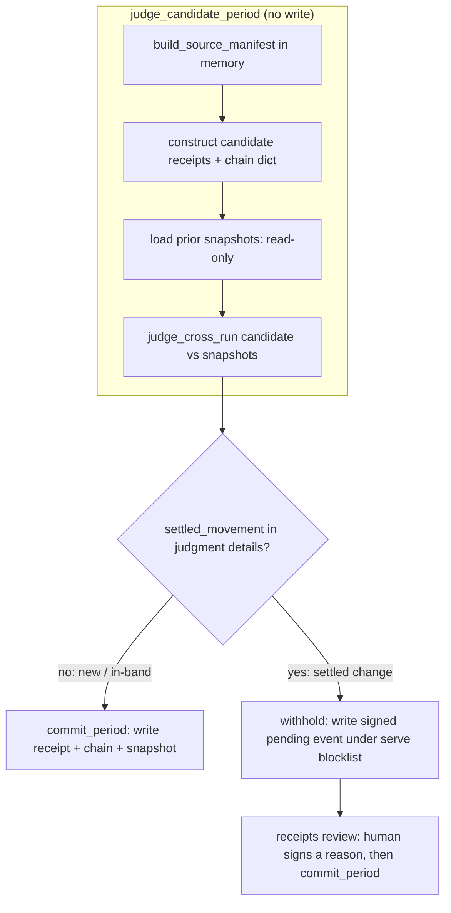
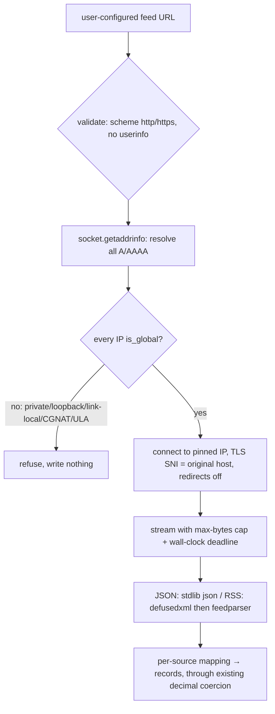

# feat: Tamper Signal v2.0 Phase B — live-source watcher

## Summary

Build the embedded live-source watcher: connect an HTTP/JSON-API or RSS feed and keep it on the same signed chain. New data auto-appends; a retroactive change to an already-settled period is judged by the declared band/settle and **paused for a human signed reason** instead of being signed unattended. The enabling refactor splits the chain-append step into **judge-then-commit** so the watcher can judge a candidate before signing it. Python-first; the connector's network/parsing dependencies ride an optional `[watch]` install extra. (See origin: `docs/brainstorms/2026-06-25-v2-data-provenance-requirements.md`.)

## Problem Frame

This plan assumes **Phase A is implemented** (the signed annotation record, the timeline, the console custody layer, the enforced table, `receipts custody`) — it reuses Phase A's `build_annotation`, the console's additive-layer pattern, and the serve blocklist. The `origin:` brainstorm (R11–R14, AE1/AE2) and the same-branch companion `docs/plans/2026-06-26-001-feat-v2-data-provenance-plan.md` (which carries the identical R11–R14 in its Phase B section) are the upstream authorities.

Phase A shipped the on-disk provenance surfaces (signed annotations, the published timeline, the console custody view, the enforced table, `receipts custody`). What it cannot do is keep a *continuously-updating* source under custody: every refresh is a manual re-ingest. Phase B closes that — but it crosses three lines the rest of the tool never does. It **commits to the chain unattended**, so it must decide *before* signing whether a change is safe to auto-accept. It **holds a signing key in an unattended process**, so key trust and isolation become security-critical. And it **fetches untrusted external input**, so SSRF, malicious feeds, and resource exhaustion enter the threat model. The judgment machinery to decide "safe to auto-accept" already exists (`judge_cross_run` is pure and disk-free); the work is to run it on a *candidate* before the write, harden the network edge, and gate the settled case behind a human.

---

## High-Level Technical Design

**The chain-append decomposition.** Today `append_period` (`tamper_signal/wrapper.py`) calls `ingest_file`, which **writes the manifest and overwrites `chain.json`**, and only *then* runs `judge_cross_run`. The watcher must judge first. Research confirms `judge_cross_run` reads nothing from disk — it operates entirely on the `receipts`, `chain`, and `snapshots` arguments — so a candidate built in memory can be judged with no write and no rollback. The split:

The existing interactive `append_period` becomes `commit_period(*judge_candidate_period(...))` — its behavior and the `ingest --as period` path are preserved byte-for-byte. The watcher tick uses the two halves separately.

**The connector edge.** Every fetch validates the URL, resolves and pins the IP, caps the body, parses safely, and maps to records that canonicalize identically to a file ingest:

---

## Requirements

Carried from origin (R11–R14), grouped.

**Connect and append**

- R11. Connect a live source (HTTP/JSON API, RSS, or comparable polled feed) and keep it on the same signed chain via a watcher running inside the host app, self-hosted, with no Tamper Signal cloud. Default shape is a stateless scheduled tick; an optional long-running daemon provides continuous polling.
- R12. New data (new rows or periods) from a live source is appended automatically by the watcher, attributed to the source/watcher identity.

**Judge and withhold**

- R13. A retroactive change to recorded data is judged by the declared tolerance: within band and inside the settling window it folds in automatically; once the bucket is settled, any movement pauses as a flagged event requiring a human signed reason before acceptance.
- R14. The watcher holds a signing key to append unattended, but withholds auto-signing for settled-period changes; those wait for a human.

---

## Key Technical Decisions

- KTD1. **Judge a candidate in memory, then commit — no write-then-rollback.** `judge_cross_run` is pure and disk-free, so `judge_candidate_period` builds the signed source manifest in memory (extracting `ingest_file`'s pure half), constructs a candidate chain dict, loads prior snapshots (read), and judges — writing nothing. `commit_period` performs the existing writes (`write_receipt` → `write_chain`, which populates `receipt_hashes` from disk → `archive_run_snapshot`). On withhold, the prior chain is untouched by construction. The judge→commit pair is a single-writer transaction: take an advisory lock / lockfile on the chain dir, and `commit_period` **asserts the on-disk chain tail equals the tail the candidate was judged against**, refusing to write (rather than committing a `breached` guard computed against a now-stale view) if a concurrent tick, daemon overlap, or a delayed accept moved the chain in between.
- KTD2. **The watcher auto-commits only a clean candidate; it withholds on ANY judgment caveat, not just `settled_movement`.** A `band_breach` *means* the value breached the declared band — including the cumulative-drift cap (`abs(cur - first) > band * elapsed_days * abs(first)` in `_judge_buckets`), which is the only defense against an attacker dripping per-step-in-band values that cumulatively rewrite a settling bucket. Gating only on `settled_movement` would auto-fold that exact attack, and would silently sign band-breaching drift a human would otherwise see as yellow. So the gate withholds whenever `judgment["details"]` is non-empty (any `band_breach`, `settled_movement`, `bucket_removed`, or `bucket_loss`); only new data and strictly in-band changes (a clean, caveat-free judgment) auto-commit. Read the typed `details`, not the `breached` map (which collapses types and is the baseline-advancement guard, threaded only into `archive_run_snapshot` at commit). A brand-new bucket (no prior observation) is new data and auto-appends.
- KTD3. **Python-first; no Node `watch`/`review`.** AGENTS.md promises interchangeable *chains*, not interchangeable *commands* (`anchor` and `custody` are already Python-only). The watcher produces ordinary signed source manifests and run snapshots that Node already reads and verifies, so chains stay interchangeable. Surface the Python-only limitation on the **Node integrator's path** — the `tamper-signal/express` (`node/express.js`) docs and the runbook a Node host reads — not only the AGENTS.md Python-only column, since R11's "runs inside the host app" speaks directly to that audience.
- KTD4. **The connector's network/parsing deps ride an optional `[watch]` extra.** Mirror the `[anchor]` extra: the base install stays `openpyxl` + `cryptography`; `pip install "tamper-signal[watch]"` adds `httpx`, `feedparser`, and `defusedxml`. `httpx` already ships as a dev dependency. Keeps the minimal-dependency posture for everyone who does not run a watcher.
- KTD5. **SSRF defense is resolve-and-pin, gated on `is_global`, with redirects off.** Validate with `urllib.parse` + `ipaddress` (not string matching, which hex/octal/dword encodings bypass). Resolve all A/AAAA records with `socket.getaddrinfo`, require **every** resolved IP to be `is_global` (rejects RFC1918, loopback, link-local, CGNAT `100.64/10`, IPv6 ULA, metadata `169.254.169.254`). For any IPv6 result, apply the IPv4 rules to its `ipv4_mapped` form too — `::ffff:10.0.0.1`'s `is_global` can return True while the connection reaches a private IPv4 host. Then **connect to the pinned numeric IP** (passed as the literal address, so no second DNS lookup) with TLS SNI/cert validation bound to the original host — this requires a custom `httpx` transport (the cited Prefect `SSRFProtectedHTTPTransport`), since httpx's stock client re-resolves at connect and reopens the TOCTOU window. **Redirects are off** (`follow_redirects=False`) — a public server 302'ing to a private IP after a passing pre-flight is a known bypass; following is a separate, explicitly-documented decision requiring a second full resolve-and-pin. No `verify=False` path exists — invalid certs fail closed.
- KTD6. **Bound the fetch by bytes and wall-clock; parse XML through `defusedxml` so `feedparser` never re-parses raw bytes.** Stream with a chunked max-bytes cap and reject an over-cap `Content-Length` pre-read; a read timeout measures only inter-chunk gaps, so check a `time.monotonic()` deadline **after every chunk read** (small `chunk_size`) for total transfer (the slow-drip bypass). For RSS/Atom, parse the raw bytes with `defusedxml` (`forbid_dtd=True`) and hand `feedparser` the **already-parsed tree**, never raw bytes — feedparser will otherwise re-parse with its own backend and process entities `defusedxml` was meant to block. JSON uses stdlib `json`. Pin minimum versions in the extra (`defusedxml>=0.7`, `feedparser>=6.0`).
- KTD7. **Feed values are untyped text — route them through the existing decimal coercion.** A feed's `"30.00"` must hash identically to a CSV's `30.0` (`_coerce_decimal` / `decimal_to_plain_string`), or the watcher false-reds. Every new feed loader joins the cross-format same-hash test. Files the watcher writes at runtime are LF (the receipt byte-hash is line-ending-sensitive), and committed watcher fixtures are tested through the real CLI verify path with both hash maps.
- KTD8. **The watcher key is the chain's trusted signer; "attribution" is signed metadata, not signer identity.** Append fails closed with `UntrustedSignerError` unless the key is the chain signer or pre-trusted — a setup precondition with a test. Because the watcher therefore signs with the chain key, R12's "attributed to the source/watcher identity" lives in a **signed manifest field** (origin / source id), not in the signature: a stolen watcher key forges appends cryptographically indistinguishable from human ones (a residual the plan states plainly, see Risks). The key is dedicated and distinct from any interactive human key — its value is isolation and revocability, not on-chain distinguishability. **Read the key from a file path** the watcher loads directly (mode `0600`, fail closed if group/world-readable), or systemd `LoadCredential=` (v250+); do **not** put the key *material* in `EnvironmentFile` — that exposes it via `/proc/<pid>/environ`. A real sign→verify round-trip guards the unattended path (monkeypatched boundaries have twice missed real divergence here).
- KTD9. **Default is a stateless tick; the daemon is a thin opt-in, framed as a local file-writer.** The recommended deployment is the tick under a systemd timer / cron / launchd (the key is not resident between ticks); the daemon is a thin loop with clean shutdown. Document the systemd hardening (`NoNewPrivileges`, `ProtectSystem=strict`, dedicated user, the key file via `LoadCredential=` so the key material never enters the process environment, and `EnvironmentFile` used only for the key *path* if at all). Frame it as a local process that writes files, not a server exposing state, to stay consistent with the no-server positioning.
- KTD10. **Pending events are signed records under a new unpublished directory, and capture the full reviewed candidate.** A held change is captured as a signed (but unaccepted) event under `receipts/pending/`, added to the `receipts serve` 404 blocklist (a third entry beside `history/` and `archive/`), with reads confined to that directory. The event stores the **full content-addressed candidate** (the built source manifest + the chain-tail it was judged against), not just summary fields — so acceptance commits *exactly* the change the human reviewed. If the chain tail has advanced since the event was written (later ticks landed), acceptance must re-surface for review rather than commit a stale-vs-newer overwrite. Acceptance writes a Phase A annotation whose `target` is the pending event's content hash, preserving the audit trail. The signed pending-event builder lives beside `build_annotation` in `tamper_signal/annotations.py` (it mirrors that pattern), not a separate module.
- KTD11. **A watched source maps to a STABLE synthetic identity across ticks.** `judge_cross_run` only compares the current run against prior snapshots whose `source.filename` matches; a mismatch returns "source identity differs from history" with NO judgment. A feed has no file, so the watcher must derive a stable `filename`/identity from the configured source id (constant across ticks) — otherwise every tick's identity differs, judgment is skipped, and every change auto-appends unjudged while the chain stays green (R13/R14 become silent no-ops). In the watcher path, a "judgment skipped: source identity differs" outcome is a **hard error**, never a silent green append.
- KTD12. **Change detection authority is a full-content fingerprint, never the server's validator.** For a tamper-evidence tool, trusting a `304` / unchanged `ETag` to mean "unchanged" is the dangerous direction: a hostile or compromised origin can mutate a settled value while replaying the old `ETag`/`Last-Modified`, and the watcher would skip the fetch and never judge the change. So the watcher always fetches and fingerprints the full body (compared against the last committed content hash) as the authoritative no-op gate for settled data; `ETag`/`Last-Modified` conditional requests are a bandwidth optimization only, never the sole gate.

---

## Implementation Units

### U1. Decompose `append_period` into judge-then-commit

- **Goal:** Split `append_period` into `judge_candidate_period` (build + judge in memory, no write) and `commit_period` (the existing writes), with `append_period` itself preserved as their composition (KTD1).
- **Requirements:** Enables R12, R13, R14.
- **Dependencies:** none (foundational).
- **Files:** `tamper_signal/wrapper.py` (extract the pure manifest build out of `ingest_file`; add the two new entry points); `tests/test_append_period.py`, `tests/test_watch_decompose.py`.
- **Approach:** Extract `ingest_file`'s pure half (`build_source_manifest` through tolerance handling, stopping before `write_receipt`/`write_chain`) into a candidate builder. `judge_candidate_period` runs the trusted-signer check and tolerance inheritance (read-only), builds the candidate manifest + candidate `receipts`/`chain` dicts (no `receipt_hashes` needed for judgment — self-exclusion no-ops harmlessly), loads snapshots, and returns `(candidate, judgment)`. `commit_period` writes the receipt + chain (now `receipt_hashes` populates from disk) and archives the snapshot with `breached`. Keep `ingest_file` intact for the `replace` path and `receipt_step`.
- **Execution note:** Characterization-first — pin the current `append_period` / `ingest --as period` behavior with the existing suites before refactoring; they must stay green unchanged.
- **Patterns to follow:** `tamper_signal/wrapper.py` `append_period`, `ingest_file`; `tamper_signal/history.py` `judge_cross_run` (pure), `archive_run_snapshot`.
- **Test scenarios:**
  - `append_period` post-refactor produces byte-identical receipts/snapshots and the same return shape (`caveats`/`details`/`breached`/`compared`) as before (characterization).
  - `judge_candidate_period` writes nothing: the chain dir is unchanged after a call, and its judgment matches what `append_period` would have produced for the same input.
  - `commit_period` after a judge produces a chain that verifies green through the real CLI verify path (both hash maps).
  - An untrusted signer raises `UntrustedSignerError` from `judge_candidate_period` before any work, nothing written.
  - A chain whose tail is mutated between `judge_candidate_period` and `commit_period` causes `commit_period` to refuse (tail-assert), not to write a `breached` guard computed against the stale view.
- **Verification:** the existing `append_period`/`judgment`/`run_history` suites pass unchanged; the new split is exercised by the watcher units.

### U2. Source connector (`tamper_signal/sources.py`)

- **Goal:** Fetch a live feed safely and map it to canonical records (R11), behind the `[watch]` extra.
- **Requirements:** R11.
- **Dependencies:** none (parallel with U1).
- **Files:** `tamper_signal/sources.py` (new); `pyproject.toml` (`[watch]` optional extra); `tests/test_sources.py`; fixtures under `tests/fixtures/`.
- **Approach:** A `fetch(url)` built on a **custom `httpx` transport** that connects to the pre-resolved numeric IP (no second DNS lookup) with TLS SNI bound to the original host, redirects off, and the byte + wall-clock caps (KTD5, KTD6) — stock httpx re-resolves at connect and would reopen the TOCTOU window. A `map_to_records(payload, mapping)` that feeds values through the **same canonicalization entry point** real ingests use (the `_coerce_decimal` / `decimal_to_plain_string` path in `tamper_signal/canonical.py`, called on in-memory records — not re-implemented), so `"30.00"` hashes identically to a CSV `30.0` (KTD7). JSON via stdlib `json`; RSS/Atom by parsing raw bytes with `defusedxml` (`forbid_dtd=True`) and handing `feedparser` the already-parsed tree (KTD6). Per-source mapping config declares feed-field → column (exact shape in Open Questions). Import the `[watch]` deps lazily with a clear error when the extra is absent (mirror the `anchor` extra's lazy import).
- **Patterns to follow:** `tamper_signal/canonical.py` `load_records` / `_coerce_decimal`; the `[anchor]` extra's lazy-import + helpful-error pattern; `tamper_signal/anchor.py`.
- **Test scenarios:**
  - Covers R11. A JSON-API fixture and an RSS fixture each map to records that canonicalize to the same semantic hash as a CSV of the same data.
  - Numeric-looking feed text (`"030"`, `"30.00"`) coerces consistently — no false-red (joins the cross-format same-hash test).
  - A URL resolving to a private/loopback/link-local/CGNAT/ULA address — or to an IPv4-mapped IPv6 address (`::ffff:192.168.1.1`) — is refused before any connection; the connect targets the pinned numeric IP with no second resolution.
  - A 302 to a private IP after a passing pre-flight is not followed (redirects off).
  - A feed with invalid TLS, an over-cap `Content-Length`, a slow-drip body exceeding the wall-clock deadline (checked after every chunk), or a streamed body exceeding the byte cap each fail cleanly with a structured error, writing nothing.
  - An RSS feed carrying a DTD / billion-laughs entity is rejected by `defusedxml` before `feedparser` sees it (the billion-laughs payload is passed as bytes to the integration boundary to confirm); a malformed/empty/schema-violating feed fails cleanly.
- **Verification:** each feed type yields the same semantic hash as an equivalent file ingest; the hostile fixtures all fail closed.

### U3. `receipts watch` — scheduled tick that appends new data

- **Goal:** A stateless tick that polls once, appends new data via the judge-then-commit path, and exits (R11, R12).
- **Requirements:** R11, R12.
- **Dependencies:** U1, U2.
- **Files:** `tamper_signal/cli.py` (`cmd_watch`, parser); `tests/test_watch.py`; `AGENTS.md` (Python-only column; runbook).
- **Approach:** Poll the source (U2) under a **stable synthetic identity** derived from the configured source id (KTD11), build a candidate (U1's `judge_candidate_period`), and on a clean (caveat-free) judgment commit it (KTD2). New data attributes to the source via a signed manifest field, not the signature (KTD8, R12). The watcher key must be the chain signer or pre-trusted, else fail closed (KTD8). Change detection is a **full-content fingerprint** compared to the last committed hash (KTD12); `ETag`/`Last-Modified` only save bandwidth and are never the sole gate. A "judgment skipped: source identity differs" outcome is a hard error, never a silent append (KTD11). A configurable per-tick cap on new periods bounds a volumetric/noise attack from a feed that passes all checks, logging when hit. A live sign→verify round-trip smoke test guards the unattended path.
- **Patterns to follow:** `cmd_ingest` `--as period` arg set and dispatch; `tamper_signal/cli.py` `build_parser` (`add_parser`/`set_defaults`); the `--json` convention.
- **Test scenarios:**
  - Covers AE1, R12. A tick that sees a new period appends it automatically; the chain stays green; the new entry carries its source attribution.
  - Two consecutive ticks of the same feed produce snapshots with matching `run_source` identity, so `judge_cross_run` actually engages (not skipped).
  - A strictly in-band change to a still-settling bucket auto-folds (AE1).
  - The origin returns `304` (or a stable `ETag`) while the body changed → the watcher still fetches, fingerprints, and judges the change (a server validator never suppresses tamper detection).
  - A watcher key that is not the chain signer fails closed with a clear `UntrustedSignerError`, nothing written.
  - A tick whose feed yields more than the per-tick new-period cap stops at the cap and logs, rather than appending unboundedly; the unattended sign→verify round-trip succeeds end to end (not boundary-mocked).
- **Verification:** repeated ticks against an evolving fixture feed build a correct chain that verifies green.

### U4. Withhold-auto-sign-on-settled gate

- **Goal:** When judgment yields a `settled_movement`, withhold the commit and write a signed pending event instead (R13, R14).
- **Requirements:** R13, R14.
- **Dependencies:** U1, U3.
- **Files:** `tamper_signal/cli.py` (`PENDING_DIRNAME`, gate, serve-blocklist entry); `tamper_signal/annotations.py` (a `build_pending_event` function beside `build_annotation` — same signed content-addressed pattern, no new module); `tests/test_watch_settled.py`.
- **Approach:** After `judge_candidate_period`, withhold whenever the judgment carries **any** caveat (`judgment["details"]` non-empty — `band_breach` incl. the cumulative-drift cap, `settled_movement`, `bucket_removed`, `bucket_loss`), not just `settled_movement` (KTD2). On withhold, do not `commit_period`; write a **signed** pending event (own `kind`, content-addressed, via `write_text_atomic`) that stores the **full reviewed candidate** (built manifest + judged chain tail) plus the caveat summary, under `receipts/pending/`. Add that dir to `_serve_handler_class` `blocked_dirs` and confine the reader to it. Only a clean, caveat-free candidate (new data / strictly in-band) auto-commits.
- **Patterns to follow:** `tamper_signal/annotations.py` (signed content-addressed record, `write_text_atomic`, `build_annotation`); `tamper_signal/cli.py` `_serve_handler_class` blocklist; `tamper_signal/history.py` `judge_cross_run` `details`.
- **Test scenarios:**
  - Covers AE2, R13, R14. A change to a settled bucket is withheld and recorded as a signed pending event, not appended; the chain is unchanged.
  - N ticks each individually in-band but cumulatively exceeding `band * elapsed_days` produce a pending event, not silent auto-appends (the slow-drip attack is caught because the gate withholds on the cumulative `band_breach`).
  - A strictly in-band, caveat-free change auto-commits.
  - The pending event is signed, stores enough to commit the exact reviewed change, and is **not served** (`receipts serve` 404s `receipts/pending/`, including traversal spellings).
- **Verification:** a settled (or band-breaching) retroactive change never appends unattended; it surfaces as a signed pending event carrying the full reviewed candidate.

### U5. `receipts review` — human sign-off for pending changes

- **Goal:** List, accept, or reject pending events; accepting signs an annotation and commits the change (R13, R14, and Phase A R5 — supersede-free audit trail).
- **Requirements:** R13, R14.
- **Dependencies:** U4; Phase A's annotation builder (`build_annotation`, already shipped) for the signed acceptance record.
- **Files:** `tamper_signal/cli.py` (`cmd_review`); `badge/console.js` (+ `tamper_signal/static/console.js` sync) to surface pending events; `tests/test_watch_review.py`.
- **Approach:** List pending events. Accept = write a Phase A annotation whose `target` is the pending event's content hash, carrying the human reason, then commit the **exact candidate stored in the pending event** (KTD10) — not a re-derived one. If the chain tail advanced since the event was written (later ticks landed), acceptance **re-surfaces for review** rather than committing a stale delta over newer data (the `commit_period` tail-assert from KTD1 enforces this). Reject = discard the pending event without touching the chain. The console shows pending events distinctly from accepted history (additive, never feeds the verdict, like the custody layer).
- **Patterns to follow:** `cmd_annotate` (Phase A); `badge/console.js` `renderCustody` (additive layer); `tamper_signal/annotations.py` `build_annotation`.
- **Test scenarios:**
  - Covers R14. Accepting a pending change signs a reason referencing the pending hash and commits the stored candidate; the timeline shows the change with its human reason.
  - Ticks land between withhold and accept (the chain tail advances) → acceptance re-surfaces for review rather than committing the stale delta over newer data.
  - Each acceptance requires its own per-event signed reason (no batch "accept-all" that launders many settled changes through one signature).
  - Rejecting a pending change discards it without touching the chain.
  - The console surfaces pending events distinctly; static-asset sync holds (`badge/console.js` byte-identical to `tamper_signal/static/console.js`).
- **Verification:** a settled change moves from pending to accepted only via a signed human reason; the audit trail links acceptance to the exact reviewed event.

### U6. Optional daemon and operational hardening

- **Goal:** A continuous-polling mode looping the tick on an interval, plus the deployment/hardening docs (R11).
- **Requirements:** R11.
- **Dependencies:** U3, U4.
- **Files:** `tamper_signal/cli.py` (`--daemon`/interval on `watch`); `tests/test_watch_daemon.py`; `AGENTS.md` + `docs/` (systemd/cron/launchd guidance, the no-server framing).
- **Approach:** A thin loop around the tick with clean shutdown (mirror `cmd_serve`'s `KeyboardInterrupt` handling and bind-before-banner discipline). Same append/withhold semantics; no new verification behavior. Document the recommended deployment as the stateless tick under a systemd timer (with `NoNewPrivileges`, `ProtectSystem=strict`, dedicated user, and the signing key delivered via `LoadCredential=` so the key material never enters the process environment — KTD8/KTD9), framing the daemon as a local file-writer, not a server.
- **Patterns to follow:** `cmd_serve` (localhost loop, clean Ctrl+C).
- **Test scenarios:**
  - Covers R11. Tests drive single ticks (the stateless-tick design supports this); the loop applies tick semantics and a settled change still pauses for a human.
  - Clean startup/shutdown; a failed/over-limit poll logs and does not crash the loop.
  - `Test expectation: integration` — the daemon's sign→verify round-trip runs live, not mocked.
- **Verification:** the watcher runs unattended over several intervals, appending in-band data and pausing settled changes, and shuts down cleanly; the docs give a copy-pasteable hardened systemd unit.

---

## Acceptance Examples

Carried from origin; each maps to the units that satisfy it.

- AE1. In-band live change folds in (R13) — U3 (in-band branch), U4 (the gate that classifies it).
- AE2. Settled live change pauses for a human (R13, R14) — U4, U5.

---

## Scope Boundaries

**Deferred for later** (carried from origin)

- Push / webhook / streaming ingestion beyond polling.
- A phased public rollout — v2.0 ships as one coordinated release.

**Outside this product's identity** (carried from origin)

- A Tamper Signal-hosted cloud or backend — the watcher is self-hosted.
- Writing corrections back to the live source — the watcher monitors and records, never pushes upstream.
- Multi-user accounts/permissions — authorship stays tied to the signing key.

**Deferred to Follow-Up Work** (plan-local)

- Node parity for `watch`/`review` (KTD3) — Python-first; if added later, mirror the `judge_candidate_period`/`commit_period` split in `node/wrapper.js` and document the move out of the Python-only column.
- Per-source incremental cursors beyond ETag/Last-Modified/content-fingerprint (e.g. API pagination tokens).

---

## System-Wide Impact

- **The watcher is the first server-side, credentialed, unattended process** in an otherwise files-on-disk tool. The default stateless tick keeps the no-required-process model (the key is not resident between ticks); the daemon is the opt-in departure, framed as a local file-writer. No prior `docs/solutions/` decision adjudicates server-vs-no-server — capture it with `ce-compound` once it lands.
- **First runtime network dependency**, scoped to the optional `[watch]` extra so the base two-dependency install is unchanged.
- **Cross-stack:** chains stay interchangeable (Node reads/verifies watcher-produced periods); only the `watch`/`review` *commands* are Python-only. Any judgment/mapping logic that is later duplicated into Node needs its own parity guard in the same change.
- **Spec discipline:** feed→record mapping must not move any semantic hash or golden vector; if canonicalization changes, it is a `SPEC_VERSION` bump with fixtures + `node/test/vectors.json` regenerated in the same commit.

---

## Risks & Dependencies

- **DNS-rebinding TOCTOU SSRF** is the headline external risk — a vulnerability class shipped and patched in langchain/RAGFlow/AutoGPT in 2024–26. Mitigation: resolve-and-pin (KTD5), not a pre-flight check followed by an independent connect.
- **Unattended key compromise:** a watcher host breach lets an attacker forge signed appends indefinitely, indistinguishable from human ones (the watcher signs with the chain key). Mitigation: dedicated isolated key distinct from the human key, key-file `0600`/`LoadCredential` sourcing, fingerprint logged per append, least-privilege deployment (KTD8, KTD9). **No key rotation/revocation path exists** — there is no in-chain key-rotation event and no defined recipient response to an unverifiable segment. Capture this as a deferred decision (a signed key-rotation annotation before a new key takes effect) and state it plainly as the standing residual until then.
- **Silent judgment skip:** if the watcher's source identity drifts across ticks, `judge_cross_run` skips judgment and every change auto-appends green and unjudged. Mitigation: a stable synthetic identity per source and treating "identity differs" as a hard error (KTD11) — the single most load-bearing watcher correctness invariant.
- **False-red on feeds** is the worst failure class for a trust tool: untyped feed text must route through the existing decimal coercion and join the cross-format same-hash test (KTD7).
- **CRLF byte-drift** on runtime-written receipts/snapshots/pending events: ensure LF on write; test committed fixtures through the real CLI verify path; keep a `windows-latest` CI entry.
- **The decomposition must not change `append_period`:** the interactive `ingest --as period` path and `receipt_step` depend on it. Characterization-first (U1); the existing suites are the guard.
- **Dependencies:** the `[watch]` extra (`httpx`, `feedparser`, `defusedxml`); Python 3.11+ stdlib `ipaddress`/`socket`/`urllib` for SSRF validation.

---

## Open Questions

**Resolve before planning** — none (the Phase B "deferred to planning" items from the brainstorm are resolved in the KTDs above).

**Deferred to implementation**

- The exact **per-source mapping config** shape (how a user declares feed-field → column, the date/bucket column, and the metric columns). A small declarative config; the format is an implementation detail to settle against real feed fixtures.
- The pending-event record's **field layout** — its *content* is decided (KTD10: the full reviewed candidate + caveat summary, content-addressed); only the on-disk field names settle against U5's review surface.
- Whether `judge_candidate_period` ever needs a populated `receipt_hashes` on the candidate chain for a non-source-only chain (research says no for the self-exclusion path; confirm when the watcher runs against a multi-stage chain).

**Deferred to follow-up**

- **Watcher key rotation/revocation** — a signed in-chain key-rotation event and a defined recipient response to an unverifiable segment (see Risks). Out of scope for the first watcher; tracked as the standing residual.

---

## Sources / Research

- Judge-then-commit feasibility (pure, disk-free judgment): `tamper_signal/history.py` (`judge_cross_run`, `_judge_buckets`, `_format_records` — `settled_movement` shape and the `breached` merge); `tamper_signal/wrapper.py` (`append_period`, `ingest_file` build/write seam); `tamper_signal/receipts.py` (`build_source_manifest` pure, `write_chain` populates `receipt_hashes`).
- Node parity / Python-only precedent: `node/wrapper.js` `appendPeriod`, `node/history.js` `judgeCrossRun`; `AGENTS.md` command-parity table (interchangeable chains, not commands).
- Serve blocklist for pending events: `tamper_signal/cli.py` `_serve_handler_class`.
- No existing server-side HTTP/polling code (connector is net-new): only `cmd_doctor`'s one-shot `urllib.request.urlopen`; runtime deps are `openpyxl` + `cryptography` (`pyproject.toml`).
- Byte-sensitivity / canonicalization learnings: `docs/solutions/logic-errors/numeric-text-canonicalization-cross-format-hash-mismatch.md`; `docs/solutions/integration-issues/windows-git-autocrlf-receipt-chain-hash-mismatch.md`; `docs/solutions/logic-errors/sigstore-federated-oidc-issuer-certificate-mismatch.md`; `docs/solutions/logic-errors/browser-zip-writer-drift-no-parity-test.md`.
- External (SSRF/feeds/daemon): OWASP SSRF Prevention Cheat Sheet; Prefect PR #21591 (`SSRFProtectedHTTPTransport`, resolve-and-pin); RAGFlow #15173 and AutoGPT GHSA-wvjg-9879-3m7w (TOCTOU anatomy); `defusedxml` (PyPI); `feedparser` 6.0.12 ETag/Last-Modified docs; systemd-timer-vs-cron hardening guidance.
